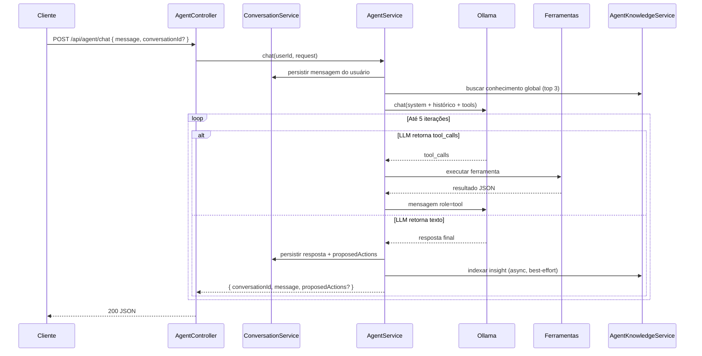

# FinControl — Backend API

[](https://deepwiki.com/FilipePaixao/financial-backend)

Backend do **FinControl** — projeto **em desenvolvimento** de controle financeiro pessoal com assistente de IA integrado. A API expõe gestão de usuários, despesas e dashboard, **onboarding conversacional**, perfil personalizado, **benchmark regional de custo de vida** e busca híbrida de despesas, além de um agente financeiro experimental (consulta dados, propõe ações, aprende com conversas anonimizadas).

Construído em **Node.js**, **TypeScript**, **Express** e **MongoDB** (Mongoose), com **PostgreSQL/pgvector**, **OpenSearch**, validação **OpenAPI**, testes **Jest** e arquitetura em **camadas** (domain, application, infraestructure, configuration).

---

## Sobre o projeto

> **Status: em desenvolvimento ativo.** O FinControl **não é um produto comercial** nem um serviço disponível ao público. É um projeto pessoal/side project em construção — APIs, agente de IA e integrações podem mudar, quebrar ou ficar incompletas. **Não use para finanças reais em produção** sem avaliar os riscos por conta própria.

O FinControl nasceu de uma **necessidade pessoal**: organizar finanças do dia a dia sem depender de planilhas frágeis nem de apps genéricos que não entendem o *seu* contexto. Queria algo que respondesse perguntas como *"quanto sobrou este mês?"* ou *"cadastra essa despesa"* com base nos **meus dados reais** — não em respostas genéricas de um chatbot.

O que você vê aqui é o **backend em evolução** de uma ferramenta que ainda estou construindo para uso próprio. Já há assistente de IA local (Ollama), onboarding guiado por chat, perfil financeiro personalizado, persistência de conversas, RAG e busca híbrida sobre despesas, benchmarks regionais de aluguel (FIPE Zap / Zoneval) e um pipeline de aprendizado anonimizado — mas várias peças estão em fase experimental, sem frontend público, sem deploy estável e sem garantias de estabilidade ou segurança auditada.

Decidi **abrir o código** mesmo assim: para documentar o caminho, receber feedback cedo e permitir que outras pessoas estudem ou contribuam — não porque já exista um app pronto para download.

### Por que open source (mesmo em WIP)

Este repositório está sendo **aberto à comunidade** porque acreditamos que:

- **Controle financeiro pessoal** deve ser transparente: você sabe onde seus dados ficam e como a IA os usa.
- **Privacidade importa**: LLM local, confirmação humana antes de mutações e filtros de PII no conhecimento compartilhado não são detalhes técnicos — são escolhas de produto.
- **Aprender em público** acelera evolução: arquitetura em camadas, testes, OpenAPI e documentação existem para quem quer estudar ou contribuir, não só consumir.
- **Ninguém deveria reinventar sozinho** o que já foi resolvido aqui — integrações, agente com tool calling, fine-tuning offline — pode servir de base para outros projetos.

**Expectativa realista:** isto é um **laboratório open source**, não um SaaS. Pode servir de referência, ponto de partida ou projeto colaborativo — mas não substitui apps financeiros maduros nem consultoria profissional.

### O que você pode fazer aqui

| Perfil | Caminho sugerido |
|--------|------------------|
| **Curioso / early adopter** | Leia [Propósito do sistema](#1-propósito-do-sistema), [Perfil e onboarding](#41-perfil-endereço-e-onboarding) e [Assistente de IA](#5-assistente-de-ia); rode **localmente** com [Como rodar](#11-como-rodar) |
| **Desenvolvedor** | Explore [Arquitetura](#3-arquitetura-em-camadas), [AGENTS.md](AGENTS.md) ou a [wiki dinâmica no DeepWiki](https://deepwiki.com/FilipePaixao/financial-backend); abra issues ou PRs |
| **Contribuidor** | Veja [Contribuindo](#15-contribuindo) — bugs, features, docs e testes são bem-vindos |

Feedback, ideias e pull requests são encorajados. Se o projeto te ajudou ou você quer ajudar a evoluir, **sinta-se em casa**.

**Documentação:** [docs/architecture-and-layers.md](docs/architecture-and-layers.md) · [AGENTS.md](AGENTS.md) · [DeepWiki](https://deepwiki.com/FilipePaixao/financial-backend) (wiki gerada a partir do código, com Q&A; o badge acima mantém refresh semanal automático)

---

## Índice

- [Sobre o projeto](#sobre-o-projeto)
1. [Propósito do sistema](#1-propósito-do-sistema)
2. [Stack e componentes](#2-stack-e-componentes)
3. [Arquitetura em camadas](#3-arquitetura-em-camadas)
4. [Domínio financeiro (API core)](#4-domínio-financeiro-api-core)
   - [Perfil, endereço e onboarding](#41-perfil-endereço-e-onboarding)
   - [Busca híbrida de despesas](#42-busca-híbrida-de-despesas)
   - [Economia regional](#43-economia-regional)
5. [Assistente de IA](#5-assistente-de-ia)
   - [Visão geral](#51-visão-geral)
   - [Fluxo de uma mensagem](#52-fluxo-de-uma-mensagem)
   - [Ferramentas (tool calling)](#53-ferramentas-tool-calling)
   - [Ações com confirmação humana](#54-ações-com-confirmação-humana)
   - [System prompt](#55-system-prompt)
   - [Conversas e histórico](#56-conversas-e-histórico)
6. [RAG — contexto financeiro por usuário](#6-rag--contexto-financeiro-por-usuário)
7. [Conhecimento global da comunidade](#7-conhecimento-global-da-comunidade)
8. [Fine-tuning offline](#8-fine-tuning-offline)
9. [Pré-requisitos](#9-pré-requisitos)
10. [Configuração](#10-configuração)
11. [Como rodar](#11-como-rodar)
12. [Endpoints da API](#12-endpoints-da-api)
13. [Scripts disponíveis](#13-scripts-disponíveis)
14. [Testes e qualidade](#14-testes-e-qualidade)
15. [Contribuindo](#15-contribuindo)
16. [Licença](#16-licença)

---

## 1. Propósito do sistema

O FinControl ajuda pessoas a **organizar, entender e melhorar suas finanças pessoais**. O backend expõe:

| Capacidade | Descrição |
|------------|-----------|
| **Gestão financeira** | CRUD de despesas, renda/salário, dashboard com resumo mensal, pagamento de despesas |
| **Autenticação** | JWT (access + refresh) com isolamento por usuário; registro indica se onboarding é necessário |
| **Perfil e onboarding** | Coleta de endereço (CEP), área de atuação, perfil de investimento e situação de moradia — via formulário e chat dedicado |
| **Assistente de IA** | Chat conversacional via LLM local (Ollama) com **tool calling**, contexto personalizado e benchmark regional |
| **Busca híbrida** | Listagem de despesas com `?search=` combina OpenSearch (lexical) + pgvector (semântico) via RRF |
| **RAG** | Embeddings por despesa no Postgres/pgvector; sincronização incremental após mutações |
| **Economia regional** | Estimativa de aluguel e custo de vida por CEP (FIPE Zap, ViaCEP; Zoneval opcional) |
| **Conhecimento global** | Dicas educativas anonimizadas extraídas de conversas, compartilhadas entre usuários sem PII |
| **Fine-tuning** | Pipeline offline para exportar conversas reais e treinar um modelo customizado |

O agente **não persiste alterações sozinho**: cadastros e atualizações passam por proposta → confirmação explícita do usuário na interface.

---

## 2. Stack e componentes

| Área | Tecnologia / padrão |
|------|---------------------|
| HTTP | Express, Helmet, rotas por controller |
| Contrato da API | `express-openapi-validator` + `src/contracts/service.yaml` |
| Persistência principal | MongoDB (Mongoose) — usuários, despesas, conversas, mensagens |
| Vetores / embeddings | PostgreSQL + pgvector — RAG por despesa e conhecimento global |
| Busca lexical | [OpenSearch](https://opensearch.org) — índice de despesas por usuário |
| Endereço | [ViaCEP](https://viacep.com.br) — lookup de CEP |
| Economia regional | FIPE Zap (dados locais) + [Zoneval](https://zoneval.com) (opcional, por CEP) |
| LLM | [Ollama](https://ollama.com) — modelo local com suporte a **tool calling** |
| Embeddings | `mock` ou `ollama` (`nomic-embed-text`); dimensão configurável (`EMBEDDING_VECTOR_SIZE`) |
| Autorização | `@sauvvitech/st-packages` — JWT, grupos, erros traduzidos |
| Observabilidade | `traceability` (async hooks / logging) |
| Qualidade | ESLint, Prettier, Jest, Husky |

---

## 3. Arquitetura em camadas

Fluxo típico: **HTTP → Controller → Service → Repositório → Banco de dados**.

```text
src/
├── application/controllers/   # Express: rotas e delegação ao service
├── configuration/             # dotenv, factories (DI), env-constants
├── contracts/               # OpenAPI (service.yaml)
├── domain/                    # Entidades, services, contratos de repositório
│   ├── agent/                 # Assistente IA, conversas, conhecimento global
│   ├── onboarding/            # Fluxo conversacional pós-cadastro
│   ├── address/               # Lookup de CEP (ViaCEP)
│   ├── expense/               # Despesas
│   ├── expense-search/        # Busca híbrida (OpenSearch + pgvector)
│   ├── regional-economics/    # Benchmark de aluguel e custo de vida
│   ├── dashboard/             # Resumo financeiro
│   ├── user/                  # Usuários, perfil e renda
│   └── rag/                   # RAG e embeddings
├── infraestructure/           # Mongo, Postgres, OpenSearch, Ollama, adapters, i18n
└── __tests__/                 # Unitários e integração
```

Detalhes, diagramas Mermaid e anti-padrões: [docs/architecture-and-layers.md](docs/architecture-and-layers.md).

---

## 4. Domínio financeiro (API core)

Contextos principais expostos pela API:

| Contexto | Responsabilidade |
|----------|------------------|
| **Auth** | Registro, login, refresh token, logout, perfil autenticado (`/me`) |
| **User** | Perfil, renda mensal (`salary`), endereço, status de onboarding |
| **Expense** | CRUD de despesas com categorias, status, mês de referência e busca textual |
| **Dashboard** | Resumo financeiro: renda, despesas, saldo, comprometimento |

Categorias de despesa: `HOUSING`, `FOOD`, `TRANSPORT`, `HEALTH`, `EDUCATION`, `ENTERTAINMENT`, `SUBSCRIPTIONS`, `DEBT`, `INVESTMENT`, `OTHER`.

Status: `PENDING`, `PAID`, `OVERDUE`.

Todas as rotas protegidas exigem JWT válido; dados são isolados por `userId`.

### 4.1 Perfil, endereço e onboarding

Após o registro, o usuário recebe `onboardingRequired: true` até concluir o fluxo de verificação de perfil.

**Fluxo em duas etapas:**

1. **Formulário** — o frontend coleta CEP e número via `PUT /api/users/me/profile/address` (lookup auxiliar em `GET /api/address/zip/:zipCode`).
2. **Chat de onboarding** — assistente dedicado (`POST /api/agent/onboarding/chat`) conduz as etapas restantes com confirmação humana na UI.

**Campos do perfil (`IUserProfile`):**

| Campo | Valores / formato |
|-------|-------------------|
| `address` | CEP, rua, bairro, cidade, UF, número, complemento |
| `occupationArea` | Texto livre (profissão ou área de atuação) |
| `investmentProfile` | `CONSERVATIVE`, `MODERATE`, `AGGRESSIVE` |
| `livingSituation` | `ALONE`, `WITH_PARENTS`, `WITH_PARTNER`, `WITH_ROOMMATES`, `OTHER` |

**Estados de verificação (`EUserVerificationStatus`):**

`PENDING_ADDRESS` → `PENDING_OCCUPATION` → `PENDING_INVESTMENT_PROFILE` → `PENDING_LIVING_SITUATION` → `READY_TO_COMPLETE` → `COMPLETED`

Consulte o progresso em `GET /api/users/me/onboarding`. O assistente financeiro principal só recebe contexto personalizado completo após `COMPLETED`.

System prompt do onboarding: [`src/domain/agent/prompts/onboarding-system-prompt.md`](src/domain/agent/prompts/onboarding-system-prompt.md).

### 4.2 Busca híbrida de despesas

`GET /api/expenses?search=<termo>` ativa busca híbrida via `ExpenseSearchService`:

1. **Lexical** — OpenSearch indexa nome, descrição, categoria e labels da despesa.
2. **Semântica** — pgvector busca embeddings da mesma despesa (RAG).
3. **Fusão** — [Reciprocal Rank Fusion (RRF)](src/domain/expense-search/utils/reciprocal-rank-fusion.utils.ts) combina os rankings.

Sem `search`, a listagem usa filtros MongoDB (`category`, `status`, `referenceMonth`, `from`, `to`).

Despesas são indexadas de forma assíncrona após create/update/delete. Para reindexar tudo (OpenSearch + pgvector):

```bash
yarn db:expenses:reindex
```

### 4.3 Economia regional

`RegionalEconomicsService` estima custo de moradia com base no CEP cadastrado:

| Fonte | Escopo | Obrigatório |
|-------|--------|-------------|
| **ViaCEP** | Normalização de cidade/UF a partir do CEP | Sim |
| **FIPE Zap** | Aluguel médio por m² (dados locais por cidade) | Sim |
| **Zoneval** | Refinamento por CEP/bairro | Não (`ZONEVAL_API_KEY`) |

O perfil regional considera `livingSituation` (ex.: morar com pais → fator 0; dividir com colegas → ~40% do benchmark). O agente expõe isso via ferramenta `get_regional_cost_profile` e injeta contexto no system prompt quando o onboarding está completo.

Cache em memória configurável: `REGIONAL_CACHE_TTL_HOURS` (padrão 168 h).

---

## 5. Assistente de IA

### 5.1 Visão geral

O **Assistente FinControl** é um agente conversacional que:

- Responde em **português brasileiro**
- Consulta **dados reais** do usuário via ferramentas (não inventa números)
- **Personaliza** respostas com perfil de investimento, moradia, ocupação e benchmark regional (após onboarding)
- **Propõe** cadastros/atualizações, mas só persiste após confirmação humana
- Aplica **guarda de resposta** — corrige linguagem que sugere persistência sem confirmação (`agent-response-guard`)
- Mantém **histórico de conversas** no servidor (MongoDB), separado do chat de onboarding
- Enriquece respostas com **dicas educativas anonimizadas** da comunidade
- Roda sobre **Ollama** (LLM local), desacoplado via interface `ILlmProvider`

Implementação principal: `src/domain/agent/service/agent.service.ts`.

### 5.2 Fluxo de uma mensagem



**Pontos importantes:**

- O cliente envia apenas `{ message, conversationId? }` — **não reenvia o histórico**; o servidor carrega as últimas 20 mensagens.
- Se `conversationId` for omitido, uma nova conversa é criada automaticamente.
- Máximo de **5 iterações** LLM ↔ ferramentas por turno; após isso, retorna mensagem de fallback.
- Erros de conexão com Ollama retornam `503` (`AGENT_LLM_UNAVAILABLE`).

### 5.3 Ferramentas (tool calling)

Definidas em `src/domain/agent/tools/agent-tools.ts`:

| Ferramenta | Tipo | Descrição |
|------------|------|-----------|
| `get_financial_summary` | Leitura | Resumo do mês: renda, despesas, saldo, comprometimento |
| `list_expenses` | Leitura | Lista despesas com filtros (`referenceMonth`, `category`, `status`) |
| `get_regional_cost_profile` | Leitura | Benchmark de aluguel/custo de vida da região + comparação com despesas HOUSING |
| `propose_create_expense` | Escrita (proposta) | Propõe cadastro de despesa — **não persiste** |
| `propose_update_salary` | Escrita (proposta) | Propõe atualização de renda — **não persiste** |

**Ordem de prioridade de fontes** (definida no system prompt):

1. Ferramentas de leitura (dados deste usuário)
2. Conhecimento global da comunidade (anonimizado)
3. Conhecimento geral do modelo
4. Perguntar ao usuário quando faltar informação

### 5.4 Ações com confirmação humana

Ferramentas de escrita retornam `proposedActions` na resposta do chat:

```json
{
  "conversationId": "uuid",
  "message": { "role": "assistant", "content": "..." },
  "proposedActions": [
    {
      "id": "uuid",
      "type": "CREATE_EXPENSE",
      "summary": "Cadastrar despesa \"Aluguel\" — R$ 1500.00 (HOUSING)",
      "payload": { "name": "Aluguel", "amount": 1500, "category": "HOUSING", "referenceMonth": "2026-06" }
    }
  ]
}
```

Para executar, o frontend chama:

```http
POST /api/agent/actions/execute
{ "type": "CREATE_EXPENSE", "payload": { ... } }
```

Tipos suportados: `CREATE_EXPENSE`, `UPDATE_SALARY`. Após execução, a despesa é reindexada no OpenSearch e no pgvector (best-effort).

### 5.5 Onboarding conversacional

Assistente separado para concluir o perfil após o cadastro. Rotas dedicadas:

| Método | Rota | Descrição |
|--------|------|-----------|
| `POST` | `/api/agent/onboarding/chat` | Chat guiado por etapa (`{ message }`) |
| `POST` | `/api/agent/onboarding/actions/execute` | Executa ação confirmada |

Ferramentas dinâmicas por etapa (`onboarding-tools.ts`):

| Ferramenta | Quando |
|------------|--------|
| `propose_update_profile` | Usuário respondeu sobre o campo da etapa atual |
| `propose_complete_onboarding` | Status `READY_TO_COMPLETE` |

Tipos de ação: `UPDATE_PROFILE`, `COMPLETE_ONBOARDING`. Conversas de onboarding usam `EConversationType.ONBOARDING` — isoladas das conversas gerais do agente.

### 5.6 System prompt

Comportamento, tom, restrições e regras de negócio do assistente:

**[`src/domain/agent/prompts/agent-system-prompt.md`](src/domain/agent/prompts/agent-system-prompt.md)**

- Carregado na inicialização via `loadAgentSystemPrompt` (factory)
- Enviado como mensagem `system` ao Ollama
- Editável sem alterar TypeScript; copiado para `dist/` no build
- Pode receber blocos dinâmicos de **conhecimento global**, **perfil do usuário** e **benchmark regional** antes de cada turno

### 5.7 Conversas e histórico

| Recurso | Persistência | Detalhe |
|---------|--------------|---------|
| Conversas | MongoDB | Tipos `GENERAL` (agente) e `ONBOARDING`; isoladas por `userId` |
| Mensagens | MongoDB | Roles: `USER`, `ASSISTANT`; podem incluir `proposedActions` |
| Histórico no LLM | Memória volátil | Últimas 20 mensagens por conversa |

Mensagens exportadas para fine-tuning são marcadas com `indexedForTraining` para evitar duplicatas.

---

## 6. RAG — embeddings por despesa

Sistema de **Retrieval-Augmented Generation** por usuário, integrado à busca híbrida e sincronizado incrementalmente.

| Aspecto | Detalhe |
|---------|---------|
| **Armazenamento** | Postgres/pgvector — um embedding por despesa (`sourceType: EXPENSE`) |
| **Indexação** | `syncExpense` após create/update/delete; bulk via `syncUserFinancialContext` |
| **Consulta legada** | `POST /api/rag/ask` — busca semântica + resposta com trechos relevantes |
| **Consulta híbrida** | `ExpenseSearchService` usa `ragService.searchExpenses` com filtros |
| **Sincronização** | Disparada após mutações via agente (`AgentActionService`) e CRUD de despesas |

O agente **não usa RAG diretamente** no chat; ele usa ferramentas para dados em tempo real. O pgvector complementa a busca textual e o endpoint legado `/api/rag/ask`.

---

## 7. Conhecimento global da comunidade

Serviço: `AgentKnowledgeService` (`src/domain/agent/service/agent-knowledge.service.ts`).

**Objetivo:** compartilhar dicas educativas de finanças pessoais entre usuários **sem expor PII**.

### Como funciona

1. **Após cada resposta** do assistente, um job assíncrono (`setImmediate`) analisa a troca user ↔ assistant.
2. Um LLM extrai **apenas** uma dica genérica de educação financeira (ou `NONE` se não houver).
3. Filtros de PII rejeitam emails, CPF, valores em R$, UUIDs etc.
4. O insight aprovado é embedado e salvo em `global_knowledge_embeddings` (Postgres/pgvector).
5. Na próxima mensagem, os **3 snippets** mais similares são injetados no system prompt.

**Garantias de privacidade:**

- Nenhum dado pessoal de um usuário é exposto a outro
- Conhecimento global é anonimizado e agregado
- Falhas na indexação são silenciosas (best-effort) — não afetam o chat

---

## 8. Fine-tuning offline

Pipeline para melhorar o modelo com conversas reais, executado **fora do fluxo HTTP**.

### Por que fine-tuning?

O modelo base (`llama3.2`) é genérico. Com conversas reais anonimizadas, é possível treinar um modelo (`fincontrol-agent`) mais alinhado ao tom, domínio financeiro e padrões de resposta do FinControl.

### Pré-requisitos

- Conversas acumuladas em produção/staging
- Mínimo de amostras configurável (`AGENT_FINE_TUNE_MIN_SAMPLES`, padrão **500**)
- Ollama instalado para criar o modelo final

### Passo a passo

#### 1. Exportar dataset anonimizado

```bash
yarn agent:export-training-data
```

- Lê pares user → assistant ainda não exportados (`listMessagesPendingTrainingExport`)
- Filtra PII (emails, CPF, R$, UUIDs)
- Exige mínimo de amostras seguras; caso contrário, falha com erro
- Gera JSONL em `data/training/exports/agent-dataset.jsonl`:

```json
{"instruction":"Como está meu mês?","response":"Vou consultar seu resumo..."}
```

- Marca mensagens como exportadas e registra versão em `agent_model_versions`

Saída customizada:

```bash
yarn agent:export-training-data /caminho/custom/dataset.jsonl
```

#### 2. Pipeline completo (opcional)

```bash
# Habilitar no .env
AGENT_FINE_TUNE_ENABLED=true

yarn agent:fine-tune
```

Executa export + gera `data/training/Modelfile` com system prompt base.

#### 3. Criar modelo no Ollama

```bash
ollama create fincontrol-agent -f data/training/Modelfile
```

Para fine-tune profundo com o JSONL, use ferramentas externas compatíveis com Ollama/LoRA e depois aponte o tag gerado.

#### 4. Ativar o modelo customizado

```env
OLLAMA_MODEL=fincontrol-agent
```

#### 5. Rollback

```env
OLLAMA_MODEL=llama3.2
```

### Variáveis de fine-tuning

| Variável | Padrão | Descrição |
|----------|--------|-----------|
| `AGENT_FINE_TUNE_ENABLED` | `false` | Habilita pipeline `yarn agent:fine-tune` |
| `AGENT_FINE_TUNE_MODEL_TAG` | `fincontrol-agent` | Tag do modelo Ollama customizado |
| `AGENT_FINE_TUNE_MIN_SAMPLES` | `500` | Mínimo de pares anonimizados para export |

---

## 9. Pré-requisitos

| Componente | Obrigatório para | Notas |
|------------|------------------|-------|
| **Node.js** + **Yarn** | Tudo | Versão compatível com `package.json` |
| **MongoDB** | `yarn dev` / `yarn start` | URI em `DATABASE_URI` |
| **PostgreSQL + pgvector** | RAG, busca semântica e conhecimento global | URI em `POSTGRES_URI` |
| **OpenSearch** | Busca lexical de despesas (`?search=`) | URL em `OPENSEARCH_URL`; sobe via `docker compose` |
| **Ollama** | Agente de IA e embeddings (`EMBEDDING_PROVIDER=ollama`) | Modelo chat + `nomic-embed-text` |
| **Zoneval** | Refinamento regional por CEP | Opcional — `ZONEVAL_API_KEY` |
| **MongoDB em memória** | `yarn test:int` | Automático via `mongodb-memory-server` |

---

## 10. Configuração

Copie `.env.example` para `.env`:

```bash
cp .env.example .env
```

### Variáveis principais

| Variável | Descrição |
|----------|-----------|
| `PORT` | Porta HTTP (padrão `3000`) |
| `DATABASE_URI` | MongoDB |
| `POSTGRES_URI` | PostgreSQL com pgvector |
| `OPENSEARCH_URL` | OpenSearch (padrão `http://localhost:9200`) |
| `OPENSEARCH_INDEX` | Nome do índice de despesas (padrão `expenses`) |
| `OPENSEARCH_REFRESH_ON_WRITE` | `true` força refresh imediato no índice (dev/test) |
| `JWT_SECRET` / `JWT_REFRESH_SECRET` | Segredos JWT (mín. 32 caracteres) |
| `JWT_ACCESS_EXPIRES_IN` | Expiração access token (ex.: `15m`) |
| `JWT_REFRESH_EXPIRES_IN` | Expiração refresh token (ex.: `7d`) |
| `EMBEDDING_PROVIDER` | `mock` ou `ollama` |
| `EMBEDDING_VECTOR_SIZE` | Dimensão dos vetores (padrão `768` com Ollama) |
| `OLLAMA_EMBEDDING_MODEL` | Modelo de embedding (padrão `nomic-embed-text`) |
| `OLLAMA_BASE_URL` | URL do Ollama (padrão `http://localhost:11434`) |
| `OLLAMA_MODEL` | Modelo LLM (padrão `llama3.2`) |
| `OLLAMA_TIMEOUT_MS` | Timeout das chamadas LLM (padrão `60000`) |
| `OLLAMA_NUM_CTX` | Tamanho do contexto em tokens (padrão `32768`) |
| `ZONEVAL_API_KEY` / `ZONEVAL_API_SECRET` | Credenciais Zoneval (opcional) |
| `ZONEVAL_BASE_URL` | Base URL Zoneval (padrão `https://api.zoneval.com`) |
| `REGIONAL_CACHE_TTL_HOURS` | TTL do cache regional em horas (padrão `168`) |
| `AGENT_FINE_TUNE_*` | Ver [Fine-tuning offline](#8-fine-tuning-offline) |
| `RUN_PG_INTEGRATION` | `true` para testes de integração com Postgres |

### Ollama (agente de IA e embeddings)

```bash
ollama pull llama3.2
ollama pull nomic-embed-text
ollama serve
```

```env
OLLAMA_BASE_URL=http://localhost:11434
OLLAMA_MODEL=llama3.2
OLLAMA_TIMEOUT_MS=60000
OLLAMA_NUM_CTX=32768
EMBEDDING_PROVIDER=ollama
EMBEDDING_VECTOR_SIZE=768
OLLAMA_EMBEDDING_MODEL=nomic-embed-text
```

---

## 11. Como rodar

```bash
# Subir MongoDB + Postgres (pgvector) + OpenSearch via Docker
docker compose up -d

# Instalar dependências
yarn install

# Desenvolvimento (hot reload)
# Aplica scripts SQL do Postgres na subida (CREATE IF NOT EXISTS)
yarn dev

# Build + produção
yarn build
yarn start

# Health check
curl http://localhost:3000/health
```

> **Postgres:** os scripts em `src/infraestructure/db/postgres/init/` rodam automaticamente no `yarn dev`/`yarn start`. Se o volume Docker foi criado **antes** de existir algum script (ex.: `004_financial_embeddings_filters.sql`), rode manualmente: `yarn db:postgres:init` ou recrie o volume (`docker compose down -v && docker compose up -d`).

> **OpenSearch:** necessário para `GET /api/expenses?search=`. Sem OpenSearch, a API continua funcionando — apenas a busca textual híbrida fica indisponível.

> **Reindexação:** após subir OpenSearch pela primeira vez ou migrar dados, execute `yarn db:expenses:reindex` para popular o índice e sincronizar embeddings.

---

## 12. Endpoints da API

Contrato completo: [`src/contracts/service.yaml`](src/contracts/service.yaml).

### Autenticação e usuários

| Método | Rota | Descrição |
|--------|------|-----------|
| `POST` | `/api/auth/register` | Registro (retorna `onboardingRequired`) |
| `POST` | `/api/auth/login` | Login |
| `POST` | `/api/auth/refresh` | Refresh token |
| `POST` | `/api/auth/logout` | Logout |
| `GET` | `/api/me` | Perfil do usuário autenticado |

### Perfil e onboarding

| Método | Rota | Descrição |
|--------|------|-----------|
| `PUT` | `/api/users/me/salary` | Atualiza renda mensal |
| `PUT` | `/api/users/me/profile/address` | Salva endereço (CEP + número) |
| `GET` | `/api/users/me/onboarding` | Status e campos pendentes do onboarding |
| `GET` | `/api/address/zip/:zipCode` | Lookup de endereço por CEP (ViaCEP) |

### Financeiro

| Método | Rota | Descrição |
|--------|------|-----------|
| `GET/POST` | `/api/expenses` | Listar / criar despesas (`?search=` para busca híbrida) |
| `GET/PUT/DELETE` | `/api/expenses/:id` | CRUD por ID |
| `PATCH` | `/api/expenses/:id/pay` | Marcar despesa como paga |
| `GET` | `/api/dashboard` | Resumo financeiro do mês (`?referenceMonth=`) |

### Agente de IA

| Método | Rota | Descrição |
|--------|------|-----------|
| `GET` | `/api/agent/conversations` | Lista conversas do usuário |
| `POST` | `/api/agent/conversations` | Cria conversa vazia |
| `GET` | `/api/agent/conversations/:id` | Conversa com histórico |
| `PATCH` | `/api/agent/conversations/:id` | Renomeia conversa |
| `DELETE` | `/api/agent/conversations/:id` | Exclui conversa e mensagens |
| `POST` | `/api/agent/chat` | Envia mensagem (`conversationId` opcional) |
| `POST` | `/api/agent/actions/execute` | Executa ação confirmada |

### Onboarding (assistente dedicado)

| Método | Rota | Descrição |
|--------|------|-----------|
| `POST` | `/api/agent/onboarding/chat` | Chat guiado por etapa |
| `POST` | `/api/agent/onboarding/actions/execute` | Executa `UPDATE_PROFILE` ou `COMPLETE_ONBOARDING` |

**Exemplo — chat:**

```http
POST /api/agent/chat
Authorization: Bearer <token>
Content-Type: application/json

{
  "message": "Como estão minhas finanças em junho?",
  "conversationId": "opcional-uuid"
}
```

### RAG (legado)

| Método | Rota | Descrição |
|--------|------|-----------|
| `POST` | `/api/rag/ask` | Pergunta com busca semântica sobre despesas indexadas |

> **Breaking change:** `POST /api/agent/chat` recebe `{ message, conversationId? }` em vez de `{ messages[] }`. O histórico fica no servidor.

---

## 13. Scripts disponíveis

| Comando | Função |
|---------|--------|
| `yarn dev` | Servidor TS com reload e `.env` |
| `yarn build` | Compila TS; copia YAML e system prompt para `dist/` |
| `yarn start` | Executa build de produção |
| `yarn test` | Unitários + integração |
| `yarn test:unit` | Apenas unitários |
| `yarn test:int` | Apenas integração |
| `yarn test:coverage` | Cobertura (meta ≥ 80%) |
| `yarn lint` / `yarn lint:fix` | ESLint |
| `yarn prettier` | Formatação |
| `yarn clean` | Remove `dist/` |
| `yarn agent:export-training-data` | Exporta JSONL anonimizado para fine-tune |
| `yarn agent:fine-tune` | Pipeline offline (export + Modelfile) |
| `yarn db:postgres:init` | Aplica migrations SQL do Postgres (pgvector) |
| `yarn db:expenses:reindex` | Recria índice OpenSearch e re-sincroniza embeddings pgvector |

---

## 14. Testes e qualidade

```bash
yarn test          # suíte completa
yarn test:coverage # cobertura (meta ≥ 80% — ver AGENTS.md)
yarn lint
```

- **Unitários:** `src/__tests__/unit/` — services, loaders, export
- **Integração:** `src/__tests__/integration/` — controllers com supertest
- Integração usa MongoDB em memória; Postgres opcional via `RUN_PG_INTEGRATION=true`

---

## 15. Contribuindo

Este é um projeto **open source em construção**. Toda contribuição conta — desde corrigir um typo na documentação até implementar uma feature nova no agente.

### Como participar

1. **Fork** o repositório e crie um branch descritivo (`feat/agent-nova-ferramenta`, `fix/export-pii`, etc.)
2. Siga a arquitetura em camadas — regras de negócio **somente** em services
3. Atualize `src/contracts/service.yaml` ao alterar endpoints
4. Adicione ou ajuste testes em `src/__tests__/` (meta de cobertura ≥ 80%)
5. Consulte [AGENTS.md](AGENTS.md) para convenções (`I*`, `IM*`, factories, etc.)
6. Abra um **Pull Request** com descrição clara do *porquê* e do *como*

### Tipos de contribuição bem-vindos

- Correções de bugs e melhorias de performance
- Novas ferramentas do agente ou endpoints da API
- Documentação (README, arquitetura, exemplos de uso)
- Testes e refatorações que preservem o comportamento
- Discussões em **Issues** sobre privacidade, UX da IA e roadmap

### O que evitar

- PRs grandes sem contexto ou sem testes
- Regras de negócio em controllers ou repositórios
- Commits com secrets (`.env`, tokens, chaves)

Dúvidas sobre por onde começar? Abra uma issue com a tag `question` — responderemos o mais rápido possível.

---

## 16. Licença

Ver o campo `license` no [`package.json`](package.json) (ISC).
