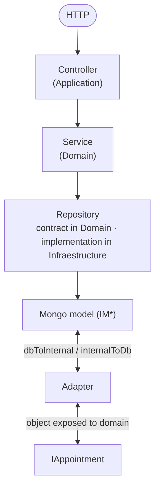
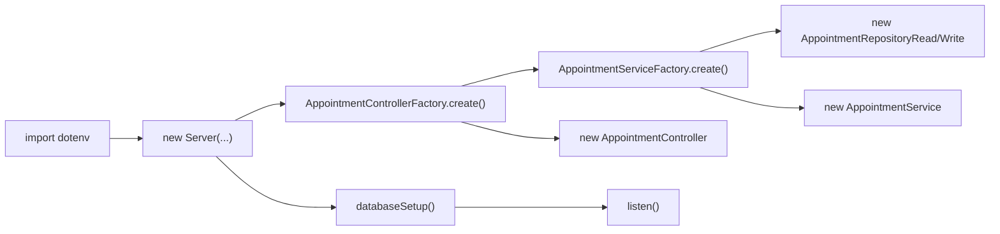
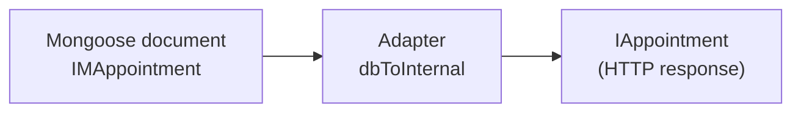
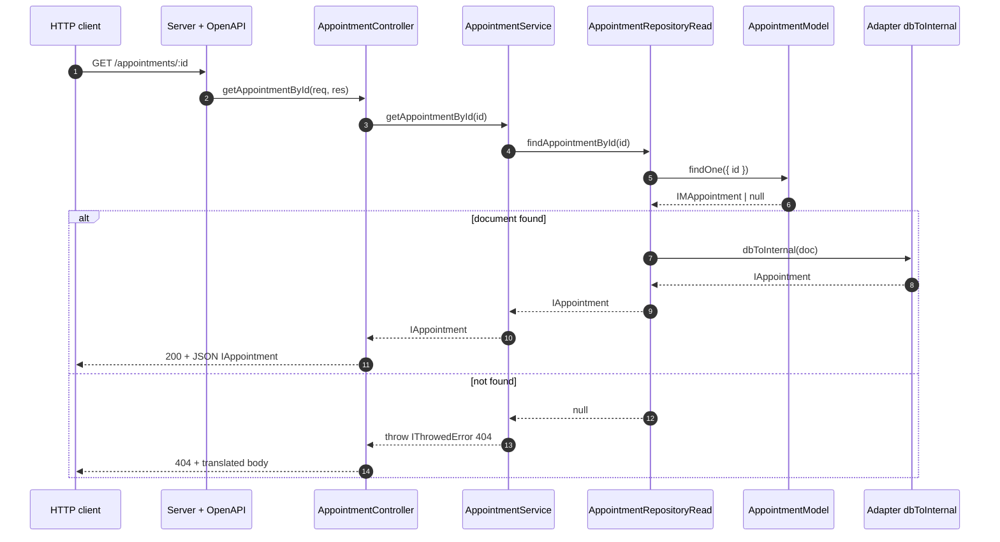
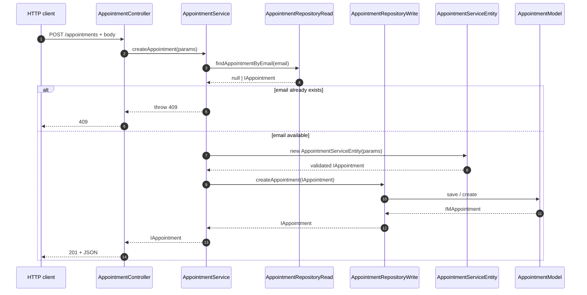
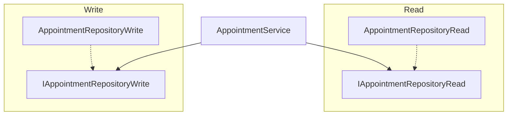
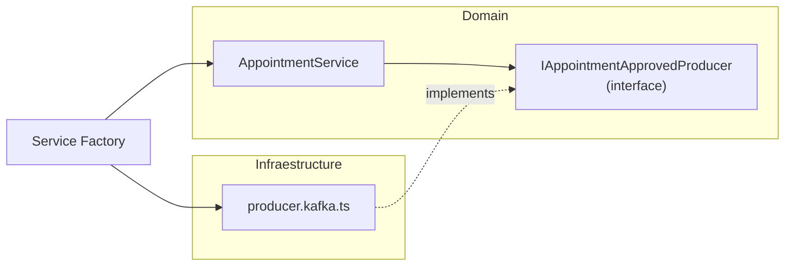

# Layered architecture

This document describes the project's **layered architecture**, the **role of each folder**, **recommended patterns**, and **examples of what to do and what to avoid**, with illustrative code snippets. For a compact reference of folders and commands, see also [`AGENTS.md`](../AGENTS.md) at the repository root.

---

## 1 Overview

The code is organized to separate:

1. **Business rules and contracts** (what the system does) — **Domain** layer.
2. **HTTP entry (Express)** — **Application** layer (controllers).
3. **Technical details** (MongoDB, Kafka, external HTTP clients, error catalog for i18n) — **Infraestructure** layer.
4. **Composition and dependency injection** (factories, env) — **Configuration** layer.
5. **API contract** (OpenAPI) — **Contracts** folder.
6. **Tests** — **`src/__tests__`** folder.

Typical request flow:



**Golden rule:** **Domain** must not import **Infraestructure** (no Mongoose, no `IM*` models, no concrete Kafka). **Application**, **Infraestructure**, and **Configuration** are what "know" the database and external frameworks.

<a id="architecture-diagrams"></a>

### 1.1 Architecture diagrams (Mermaid)

The diagrams below can be viewed in any Markdown reader with **Mermaid** support (GitHub, GitLab, VS Code with extension, Cursor, etc.).

#### Layer view and dependency direction

Dependency flow: **Configuration** builds the graph; **Application** and **Infraestructure** depend on **Domain**; **Domain** does not depend on **Infraestructure**. **Server** (Express + OpenAPI) lives in **Domain** and receives already-built controllers.

```mermaid
flowchart TB
  subgraph contracts["Contracts"]
    YAML["service.yaml"]
  end

  subgraph config["Configuration"]
    DOT["dotenv.ts"]
    UCF["AppointmentControllerFactory"]
    USF["AppointmentServiceFactory"]
  end

  subgraph application["Application"]
    UC["AppointmentController\n(Router + handlers)"]
  end

  subgraph domain["Domain"]
    SRV["AppointmentService"]
    ENT["AppointmentServiceEntity"]
    IR["IAppointmentRepositoryRead"]
    IW["IAppointmentRepositoryWrite"]
    IU["IAppointment / IAppointmentService"]
    SRV --> IR
    SRV --> IW
    SRV --> ENT
    SRV --> IU
  end

  subgraph infra["Infraestructure"]
    RREAD["AppointmentRepositoryRead"]
    RWRITE["AppointmentRepositoryWrite"]
    ADP["appointment.adapter\ndbToInternal / internalToDb"]
    MOD["AppointmentModel + AppointmentSchema\n(IMAppointment)"]
    I18N["error-catalog\n(i18n)"]
    RREAD --> ADP
    RWRITE --> ADP
    RREAD --> MOD
    RWRITE --> MOD
  end

  subgraph bootstrap["Bootstrap"]
    APP["app.ts"]
    SVR["Server\n(domain/server)"]
  end

  YAML --> SVR
  APP --> DOT
  APP --> SVR
  UCF --> UC
  USF --> SRV
  UCF --> USF
  UC -->|uses in constructor| SRV
  SVR -->|app.use(router)| UC
  UC -.->|optional: HTTP errors| I18N
  RREAD -.->|implements| IR
  RWRITE -.->|implements| IW
  USF --> RREAD
  USF --> RWRITE
  APP --> UCF
```

#### Composition at application startup (`app.ts`)

Logical order: load environment variables → instantiate `Server` with controllers created by factories → connect to Mongo → listen for HTTP.



#### Data flow: from Mongo document to domain object



In the **write** direction, `internalToDb(IAppointment)` produces the persistable payload (without `_id` / timestamps managed by the schema).

#### Sequence: read user by ID (`GET /appointments/:id`)



#### Sequence: create user (`POST /appointments`)



#### Light CQRS pattern in the repository (Read vs Write)



#### Future extension: Kafka event after persistence

When messaging exists, the **contract** is born in the domain and the **implementation** in infra; the factory injects the producer into the service.



---

## 2 Layer map

| Layer | Main path | Responsibility |
|--------|-------------------|------------------|
| **Domain** | `src/domain` | Entities, service interfaces, repository contracts, abstract server (`IController`), common domain errors |
| **Application** | `src/application` | Controllers: routes, `req` extraction, HTTP response, delegation to service |
| **Infraestructure** | `src/infraestructure` | Mongo schemas/models, concrete repositories, adapters, messaging, external services, error i18n |
| **Configuration** | `src/configuration` | `dotenv`, environment constants, **factories** that assemble controllers and services |
| **Contracts** | `src/contracts` | OpenAPI specification (e.g. `service.yaml`) |
| **Tests** | `src/__tests__` | Integration and unit tests |

**Fixed repository names:** the folder is **`infraestructure`** (with "e") and **`configuration`** (singular), as in the project — do not rename to "infrastructure" or "configurations" to avoid breaking imports.

---

## 3 Domain (`src/domain`)

### 3.1 What it is

The domain concentrates **interfaces** (`IAppointment`, `IAppointmentRepositoryRead`), **entity classes** with validation (`AppointmentServiceEntity`), **services** that orchestrate rules (`AppointmentService`), and **contracts** that infrastructure will implement later.

### 3.2 Patterns to follow

- Prefix **`I`** for domain interfaces (`IAppointment`, `IAppointmentService`).
- Repository contracts split into **read** and **write**:
  - `appointment.repository.read.ts` → `IAppointmentRepositoryRead`
  - `appointment.repository.write.ts` → `IAppointmentRepositoryWrite`
- Service depends **only on repository interfaces**, not on Mongo classes.

**Example aligned with the project (conceptual snippet):**

```ts
// src/domain/appointment/service/appointment.service.ts — pattern: inject contracts
import { IAppointmentRepositoryRead } from '../repository/appointment.repository.read';
import { IAppointmentRepositoryWrite } from '../repository/appointment.repository.write';

export class AppointmentService {
  constructor(
    private readonly appointmentRepositoryRead: IAppointmentRepositoryRead,
    private readonly appointmentRepositoryWrite: IAppointmentRepositoryWrite,
  ) {}

  async createAppointment(/* ... */): Promise<IAppointment> {
    // rules: email uniqueness, entity, etc.
    return this.appointmentRepositoryWrite.createAppointment(/* IAppointment */);
  }
}
```

### 3.3 Allowed / not allowed

| Allowed | Not allowed |
|------|----------|
| Import only other `domain` modules and agnostic packages (types, generic utils) | Import `mongoose`, `AppointmentModel`, `IMAppointment`, or any file under `src/infraestructure` |
| Throw business errors with agreed format (e.g. `IThrowedError` + `EErrorCode`) | Open database connection or read `process.env` directly in the service (prefer passing config via factory) |
| Use **entity** to validate and build `IAppointment` before persisting | Put Mongo queries or document details in the service |

**Bad (violates layer):**

```ts
// ❌ NEVER in domain/appointment/service
import { AppointmentModel } from '../../infraestructure/db/mongo/models/appointment.model';

async getUser(id: string) {
  return AppointmentModel.findOne({ id }); // couples domain to Mongo
}
```

**Good:**

```ts
// ✅ Service uses only the contract
const appointment = await this.appointmentRepositoryRead.findAppointmentById(id);
```

---

## 4 Application (`src/application`)

### 4.1 What it is

Express controllers implement `IController`, define `Router`, read `req`/`res`, and call the **service**.

### 4.2 Patterns to follow

- **Thin** controller: try/catch, HTTP status, call `appointmentService.*`.
- Authorization and middlewares can live on routes (as `authorizeByGroup` in `AppointmentController`).
- Translated errors: use of `handleTranslatedError` with catalog (`ErrorCatalog`) is a pattern observed in the project.

**Example of correct responsibility:**

```ts
createAppointment = async (req: Request, res: Response): Promise<void> => {
  const { id, name, email, createdAt } = req.body;
  try {
    const newAppointment = await this.appointmentService.createAppointment({
      id,
      name,
      email,
      createdAt: createdAt ? new Date(createdAt) : new Date(),
    });
    res.status(201).json(newAppointment);
  } catch (error) {
    handleTranslatedError(error, ErrorCatalog, res);
  }
};
```

### 4.3 Allowed / not allowed

| Allowed | Not allowed |
|------|----------|
| Extract `params`/`body`, call service, set status | Implement "email already exists" rule or heavy business validation |
| Use infra utilities for **HTTP boundary** (e.g. error catalog) | Instantiate `AppointmentRepositoryRead` manually in every method (use **factory**) |
| Register routes and middlewares | Access `AppointmentModel` directly in the controller |

**Bad:**

```ts
// ❌ Business logic in the controller
createAppointment = async (req, res) => {
  const existing = await AppointmentModel.findOne({ email: req.body.email });
  if (existing) return res.status(409).json({ message: 'Conflict' });
  // ...
};
```

**Good:** delegate to `AppointmentService.createAppointment`, which already handles conflict and uses the repository.

---

## 5 Infraestructure (`src/infraestructure`)

### 5.1 What it is

Everything that is **replaceable** or **implementation detail**: Mongo (schema, model, `IM*`), concrete repositories, pure **adapters** between `IM*` and `I*`, Kafka, HTTP clients, i18n.

### 5.2 `IM*` pattern (persistence)

Mongo interfaces extend the domain and add persistence fields:

```ts
import { Types } from 'mongoose';
import { IAppointment } from '../../../../domain/appointment/entity/interfaces/appointment.interface';

export interface IMAppointment extends IAppointment {
  _id: Types.ObjectId;
  updatedAt: Date;
}
```

Schema and model typed with `IMAppointment`.

### 5.3 Adapter (pure functions)

**Side-effect-free** conversion between document and domain:

```ts
export function dbToInternal(appointment: IMAppointment): IAppointment {
  return {
    id: user.id,
    name: user.name,
    email: user.email,
    createdAt: user.createdAt,
  };
}

export function internalToDb(
  user: IAppointment,
): Omit<IMAppointment, '_id' | 'createdAt' | 'updatedAt'> {
  return {
    id: user.id,
    name: user.name,
    email: user.email,
  };
}
```

### 5.4 Concrete repository

Implements the domain interface and uses **only** model + adapter:

```ts
export class AppointmentRepositoryRead implements IAppointmentRepositoryRead {
  async findAppointmentById(id: string): Promise<IAppointment | null> {
    const doc = await AppointmentModel.findOne({ id });
    return doc ? dbToInternal(doc) : null;
  }
}
```

### 5.5 Allowed / not allowed

| Allowed | Not allowed |
|------|----------|
| `findOne`, `create`, map with `dbToInternal` | Decide business rule "if not found, it's 404" (that is **service**) |
| Change indexes/schema per persistence needs | Expose `IMAppointment` to the controller (the outside world sees `IAppointment`) |
| Implement Kafka contracts defined in the domain | Define producer contract only in infra without interface in the domain |

**Bad:**

```ts
// ❌ Repository with product rule
async findAppointmentById(id: string): Promise<IAppointment> {
  const doc = await AppointmentModel.findOne({ id });
  if (!doc) throw { status: 404, message: 'Not found' };
  return dbToInternal(doc);
}
```

**Good:** return `null` and let the **service** throw the standardized error.

---

## 6 Configuration (`src/configuration`)

### 6.1 What it is

**Factories** bind interfaces to implementations: controller receives service; service receives `AppointmentRepositoryRead` / `AppointmentRepositoryWrite`.

**Composition example:**

```ts
export class AppointmentControllerFactory {
  static create(): IController {
    return new AppointmentController(AppointmentServiceFactory.create());
  }
}
```

### 6.2 Allowed / not allowed

| Allowed | Not allowed |
|------|----------|
| Instantiate repos + service + controller | Contain business rules ("if premium, …") |
| Read `process.env` indirectly (via `dotenv` at app startup) | Be imported by **domain** as a dependency for rules |

---

## 7 Contracts and bootstrap

- **`src/contracts/service.yaml`:** documents and validates the API (`Server` uses `express-openapi-validator`). When changing routes or payloads, **update the YAML**.
- **`src/app.ts`:** recommended order **database → HTTP server** (`databaseSetup` before `listen`), per the repository guide.

---

## 8 Tests (`src/__tests__`)

- **Integration:** controller, service, repository with test Mongo (per existing folders).
- **Unit:** mainly services and isolated logic with mocks of `IAppointmentRepositoryRead` / `Write` contracts.

Project quality target: coverage **≥ 80%** (`yarn test:coverage`), ESLint and Prettier.

---

## 9 Messaging (Kafka) — summary

1. **Interface** in the domain: `src/domain/<context>/messaging/<event>/producer.interface.kafka.ts`.
2. **Implementation** in infra: `src/infraestructure/messaging/<event>/producer.kafka.ts`.
3. **Service** calls the interface after successful persistence, when it makes sense.
4. **Factory** injects the concrete implementation.

---

## 10 Quick checklist for a new feature

1. Define or extend `I*` in **domain** (entity + interfaces).
2. `I*RepositoryRead` / `I*RepositoryWrite` contracts if data is needed.
3. Implement repository + adapter + schema/model in **infraestructure**.
4. Orchestrate in **service** (validation, conflicts, 404).
5. Expose in **controller** (HTTP).
6. Register in **factory**.
7. Update **`service.yaml`** and **tests**.

---

## 11 Summary: dependencies between layers

```text
Configuration  →  Application  →  Domain
       ↓                           ↑
Infraestructure  implements contracts declared in Domain
```

- **Domain** does not depend on **Infraestructure**.
- **Infraestructure** depends on **Domain** (interfaces, `IAppointment`).
- **Application** depends on **Domain** (services) and, in practice, may use infra utilities at the boundary (e.g. translated errors).
- **Configuration** depends on everything needed to **assemble** the object graph.

For a **graphical** view of the same relationships (layers, HTTP sequences, light CQRS, and Kafka extension), use the Mermaid diagrams in [section 1.1](#architecture-diagrams).

Following these boundaries keeps the code **testable** and **replaceable** (switching Mongo for another storage mainly changes infra + factories).
