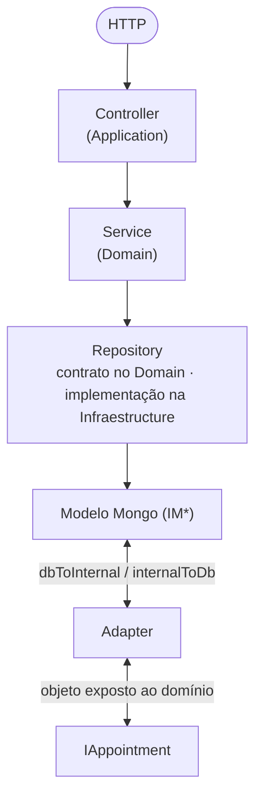
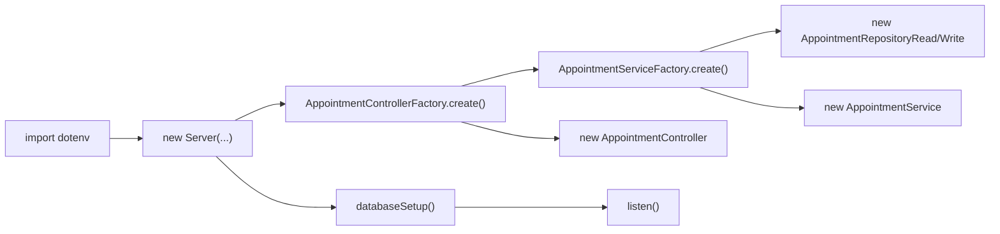
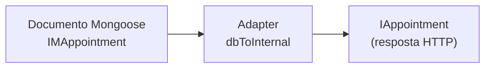
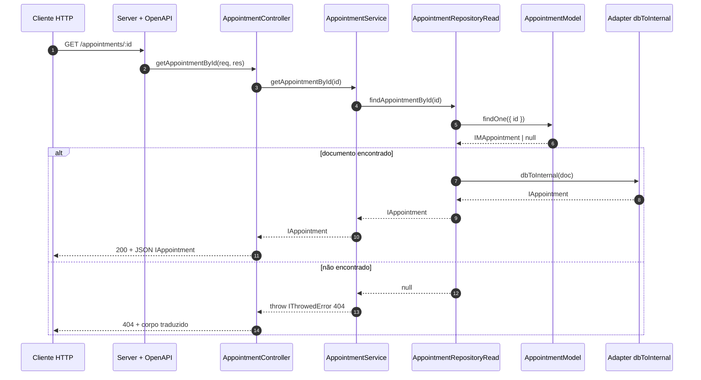
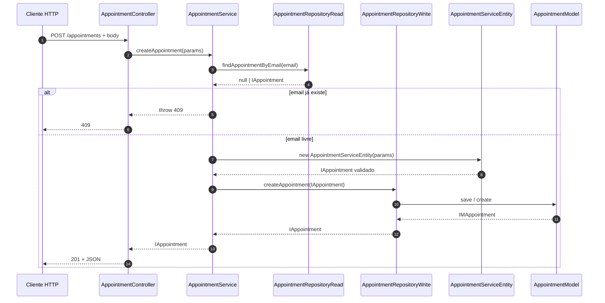
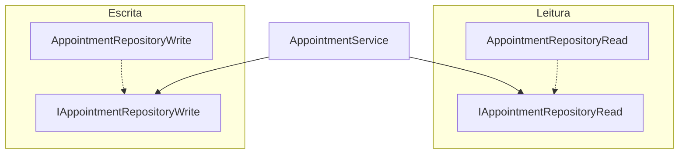
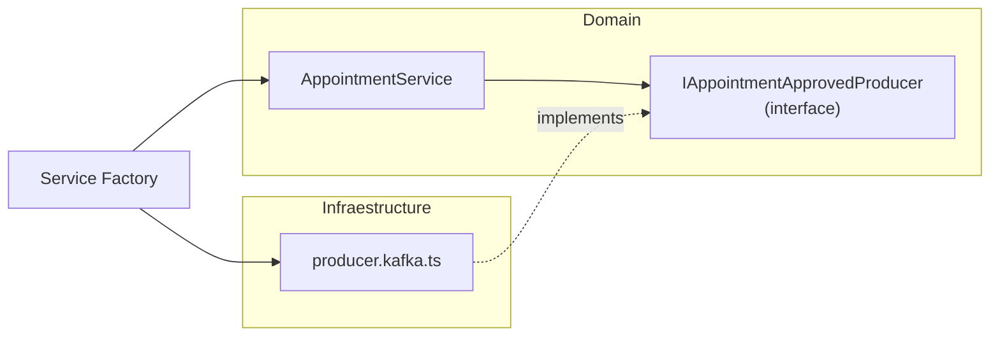

# Arquitetura em camadas do st-node-boilerplate

Este documento descreve a **arquitetura em camadas** do projeto, o **papel de cada pasta**, **padrões recomendados** e **exemplos do que fazer e do que evitar**, com trechos de código ilustrativos. Para uma referência compacta de pastas e comandos, veja também [`AGENTS.md`](../AGENTS.md) na raiz do repositório.

---

## 1 Visão geral

O código está organizado para separar:

1. **Regras de negócio e contratos** (o *quê* o sistema faz) — camada **Domain**.
2. **Entrada HTTP (Express)** — camada **Application** (controllers).
3. **Detalhes técnicos** (MongoDB, Kafka, clientes HTTP externos, catálogo de erros para i18n) — camada **Infraestructure**.
4. **Composição e injeção de dependências** (factories, env) — camada **Configuration**.
5. **Contrato da API** (OpenAPI) — pasta **Contracts**.
6. **Testes** — pasta **`src/__tests__`**.

Fluxo típico de uma requisição:



**Regra de ouro:** o **Domain** não deve importar **Infraestructure** (sem Mongoose, sem modelos `IM*`, sem Kafka concreto). Quem “conhece” o banco e frameworks externos são **Application**, **Infraestructure** e **Configuration**.

<a id="diagramas-arquitetura"></a>

### 1.1 Diagramas da arquitetura (Mermaid)

Os diagramas abaixo podem ser visualizados em qualquer leitor Markdown com suporte a **Mermaid** (GitHub, GitLab, VS Code com extensão, Cursor, etc.).

#### Visão em camadas e direção das dependências

Fluxo de dependência: **Configuration** monta o grafo; **Application** e **Infraestructure** dependem de **Domain**; o **Domain** não depende da **Infraestructure**. O **Server** (Express + OpenAPI) vive no **Domain** e recebe controllers já construídos.

```mermaid
flowchart TB
  subgraph contracts["Contracts"]
    YAML["service.yaml"]
  end

  subgraph config["Configuration"]
    DOT["dotenv.ts"]
    UCF["AppointmentControllerFactory"]
    USF["AppointmentServiceFactory"]
  end

  subgraph application["Application"]
    UC["AppointmentController\n(Router + handlers)"]
  end

  subgraph domain["Domain"]
    SRV["AppointmentService"]
    ENT["AppointmentServiceEntity"]
    IR["IAppointmentRepositoryRead"]
    IW["IAppointmentRepositoryWrite"]
    IU["IAppointment / IAppointmentService"]
    SRV --> IR
    SRV --> IW
    SRV --> ENT
    SRV --> IU
  end

  subgraph infra["Infraestructure"]
    RREAD["AppointmentRepositoryRead"]
    RWRITE["AppointmentRepositoryWrite"]
    ADP["appointment.adapter\ndbToInternal / internalToDb"]
    MOD["AppointmentModel + AppointmentSchema\n(IMAppointment)"]
    I18N["error-catalog\n(i18n)"]
    RREAD --> ADP
    RWRITE --> ADP
    RREAD --> MOD
    RWRITE --> MOD
  end

  subgraph bootstrap["Bootstrap"]
    APP["app.ts"]
    SVR["Server\n(domain/server)"]
  end

  YAML --> SVR
  APP --> DOT
  APP --> SVR
  UCF --> UC
  USF --> SRV
  UCF --> USF
  UC -->|usa no construtor| SRV
  SVR -->|app.use(router)| UC
  UC -.->|opcional: erros HTTP| I18N
  RREAD -.->|implements| IR
  RWRITE -.->|implements| IW
  USF --> RREAD
  USF --> RWRITE
  APP --> UCF
```

#### Composição na subida da aplicação (`app.ts`)

Ordem lógica: carregar variáveis de ambiente → instanciar `Server` com controllers criados pelas factories → conectar ao Mongo → escutar HTTP.



#### Fluxo de dados: de documento Mongo a objeto de domínio



No sentido **escrita**, `internalToDb(IAppointment)` produz o payload persistível (sem `_id` / timestamps geridos pelo schema).

#### Sequência: leitura de usuário por ID (`GET /appointments/:id`)



#### Sequência: criação de usuário (`POST /appointments`)



#### Padrão CQRS leve no repositório (Read vs Write)



#### Extensão futura: evento Kafka após persistência

Quando existir messaging, o **contrato** nasce no domain e a **implementação** na infra; a factory injeta o producer no service.



---

## 2 Mapa das camadas

| Camada | Caminho principal | Responsabilidade |
|--------|-------------------|------------------|
| **Domain** | `src/domain` | Entidades, interfaces de serviço, contratos de repositório, servidor abstrato (`IController`), erros de domínio comuns |
| **Application** | `src/application` | Controllers: rotas, extração de `req`, resposta HTTP, delegação ao service |
| **Infraestructure** | `src/infraestructure` | Schemas/models Mongo, repositórios concretos, adapters, messaging, serviços externos, i18n de erros |
| **Configuration** | `src/configuration` | `dotenv`, constantes de ambiente, **factories** que montam controllers e services |
| **Contracts** | `src/contracts` | Especificação OpenAPI (ex.: `service.yaml`) |
| **Testes** | `src/__tests__` | Integração e unitários |

**Nomes fixos do repositório:** a pasta é **`infraestructure`** (com “e”) e **`configuration`** (singular), conforme o projeto — não renomear para “infrastructure” ou “configurations” para evitar quebras de import.

---

## 3 Domain (`src/domain`)

### 3.1 O que é

O domínio concentra **interfaces** (`IAppointment`, `IAppointmentRepositoryRead`), **classes de entidade** com validação (`AppointmentServiceEntity`), **serviços** que orquestram regras (`AppointmentService`) e **contratos** que a infraestrutura implementará depois.

### 3.2 Padrões a seguir

- Prefixo **`I`** para interfaces de domínio (`IAppointment`, `IAppointmentService`).
- Contratos de repositório separados em **leitura** e **escrita**:
  - `appointment.repository.read.ts` → `IAppointmentRepositoryRead`
  - `appointment.repository.write.ts` → `IAppointmentRepositoryWrite`
- Serviço depende **apenas de interfaces** de repositório, não de classes Mongo.

**Exemplo alinhado ao projeto (trecho conceitual):**

```ts
// src/domain/appointment/service/appointment.service.ts — padrão: injetar contratos
import { IAppointmentRepositoryRead } from '../repository/appointment.repository.read';
import { IAppointmentRepositoryWrite } from '../repository/appointment.repository.write';

export class AppointmentService {
  constructor(
    private readonly appointmentRepositoryRead: IAppointmentRepositoryRead,
    private readonly appointmentRepositoryWrite: IAppointmentRepositoryWrite,
  ) {}

  async createAppointment(/* ... */): Promise<IAppointment> {
    // regras: unicidade de email, entity, etc.
    return this.appointmentRepositoryWrite.createAppointment(/* IAppointment */);
  }
}
```

### 3.3 Pode / não pode

| Pode | Não pode |
|------|----------|
| Importar apenas outros módulos do `domain` e pacotes agnósticos (tipos, util genérico) | Importar `mongoose`, `AppointmentModel`, `IMAppointment` ou qualquer arquivo em `src/infraestructure` |
| Lançar erros de negócio com formato acordado (ex.: `IThrowedError` + `EErrorCode`) | Abrir conexão com banco ou ler `process.env` diretamente no service (preferir passar config pela factory) |
| Usar **entity** para validar e montar `IAppointment` antes de persistir | Colocar queries Mongo ou detalhe de documento no service |

**Ruim (viola camada):**

```ts
// ❌ NUNCA no domain/appointment/service
import { AppointmentModel } from '../../infraestructure/db/mongo/models/appointment.model';

async getUser(id: string) {
  return AppointmentModel.findOne({ id }); // acopla domínio ao Mongo
}
```

**Bom:**

```ts
// ✅ Service usa só o contrato
const appointment = await this.appointmentRepositoryRead.findAppointmentById(id);
```

---

## 4 Application (`src/application`)

### 4.1 O que é

Controllers Express implementam `IController`, definem `Router`, leem `req`/`res` e chamam o **service**.

### 4.2 Padrões a seguir

- Controller **fino**: try/catch, status HTTP, chamar `appointmentService.*`.
- Autorização e middlewares podem ficar nas rotas (como `authorizeByGroup` no `AppointmentController`).
- Erros traduzidos: uso de `handleTranslatedError` com catálogo (`ErrorCatalog`) é um padrão observado no projeto.

**Exemplo de responsabilidade correta:**

```ts
createAppointment = async (req: Request, res: Response): Promise<void> => {
  const { id, name, email, createdAt } = req.body;
  try {
    const newAppointment = await this.appointmentService.createAppointment({
      id,
      name,
      email,
      createdAt: createdAt ? new Date(createdAt) : new Date(),
    });
    res.status(201).json(newAppointment);
  } catch (error) {
    handleTranslatedError(error, ErrorCatalog, res);
  }
};
```

### 4.3 Pode / não pode

| Pode | Não pode |
|------|----------|
| Extrair `params`/`body`, chamar service, definir status | Implementar regra “email já existe” ou validação de negócio pesada |
| Usar utilitários de infra para **borda HTTP** (ex.: catálogo de erros) | Instanciar `AppointmentRepositoryRead` manualmente em todo método (use **factory**) |
| Registrar rotas e middlewares | Acessar `AppointmentModel` diretamente no controller |

**Ruim:**

```ts
// ❌ Lógica de negócio no controller
createAppointment = async (req, res) => {
  const existing = await AppointmentModel.findOne({ email: req.body.email });
  if (existing) return res.status(409).json({ message: 'Conflict' });
  // ...
};
```

**Bom:** delegar ao `AppointmentService.createAppointment`, que já trata conflito e usa repositório.

---

## 5 Infraestructure (`src/infraestructure`)

### 5.1 O que é

Tudo que é **substituível** ou **detalhe de implementação**: Mongo (schema, model, `IM*`), repositórios concretos, **adapters** puros entre `IM*` e `I*`, Kafka, HTTP clients, i18n.

### 5.2 Padrão `IM*` (persistência)

Interfaces Mongo estendem o domínio e acrescentam campos de persistência:

```ts
import { Types } from 'mongoose';
import { IAppointment } from '../../../../domain/appointment/entity/interfaces/appointment.interface';

export interface IMAppointment extends IAppointment {
  _id: Types.ObjectId;
  updatedAt: Date;
}
```

Schema e model tipados com `IMAppointment`.

### 5.3 Adapter (funções puras)

Conversão **sem efeitos colaterais** entre documento e domínio:

```ts
export function dbToInternal(appointment: IMAppointment): IAppointment {
  return {
    id: user.id,
    name: user.name,
    email: user.email,
    createdAt: user.createdAt,
  };
}

export function internalToDb(
  user: IAppointment,
): Omit<IMAppointment, '_id' | 'createdAt' | 'updatedAt'> {
  return {
    id: user.id,
    name: user.name,
    email: user.email,
  };
}
```

### 5.4 Repositório concreto

Implementa a interface do domain e usa **apenas** model + adapter:

```ts
export class AppointmentRepositoryRead implements IAppointmentRepositoryRead {
  async findAppointmentById(id: string): Promise<IAppointment | null> {
    const doc = await AppointmentModel.findOne({ id });
    return doc ? dbToInternal(doc) : null;
  }
}
```

### 5.5 Pode / não pode

| Pode | Não pode |
|------|----------|
| `findOne`, `create`, mapear com `dbToInternal` | Decidir regra de negócio “se não achar, é 404” (isso é **service**) |
| Alterar índices/schema conforme necessidade de persistência | Expor `IMAppointment` para o controller (o mundo externo vê `IAppointment`) |
| Implementar contratos Kafka definidos no domain | Definir contrato de producer só na infra sem interface no domain |

**Ruim:**

```ts
// ❌ Repositório com regra de produto
async findAppointmentById(id: string): Promise<IAppointment> {
  const doc = await AppointmentModel.findOne({ id });
  if (!doc) throw { status: 404, message: 'Not found' };
  return dbToInternal(doc);
}
```

**Bom:** retornar `null` e deixar o **service** lançar o erro padronizado.

---

## 6 Configuration (`src/configuration`)

### 6.1 O que é

**Factories** ligam interfaces a implementações: controller recebe service; service recebe `AppointmentRepositoryRead` / `AppointmentRepositoryWrite`.

**Exemplo de composição:**

```ts
export class AppointmentControllerFactory {
  static create(): IController {
    return new AppointmentController(AppointmentServiceFactory.create());
  }
}
```

### 6.2 Pode / não pode

| Pode | Não pode |
|------|----------|
| Instanciar repos + service + controller | Conter regra de negócio (“se premium, …”) |
| Ler `process.env` indiretamente (via `dotenv` na subida do app) | Ser importado pelo **domain** como dependência de regras |

---

## 7 Contracts e bootstrap

- **`src/contracts/service.yaml`:** documenta e valida a API (o `Server` usa `express-openapi-validator`). Ao mudar rotas ou payloads, **atualize o YAML**.
- **`src/app.ts`:** ordem recomendada **banco → servidor HTTP** (`databaseSetup` antes de `listen`), conforme o guia do repositório.

---

## 8 Testes (`src/__tests__`)

- **Integração:** controller, service, repositório com Mongo de teste (conforme pastas existentes).
- **Unitário:** principalmente services e lógica isolada com mocks dos contratos `IAppointmentRepositoryRead` / `Write`.

Meta de qualidade do projeto: cobertura **≥ 80%** (`yarn test:coverage`), ESLint e Prettier.

---

## 9 Messaging (Kafka) — resumo

1. **Interface** no domain: `src/domain/<contexto>/messaging/<evento>/producer.interface.kafka.ts`.
2. **Implementação** na infra: `src/infraestructure/messaging/<evento>/producer.kafka.ts`.
3. **Service** chama a interface após persistência bem-sucedida, quando fizer sentido.
4. **Factory** injeta a implementação concreta.

---

## 10 Checklist rápido para nova feature

1. Definir ou estender `I*` no **domain** (entity + interfaces).
2. Contratos `I*RepositoryRead` / `I*RepositoryWrite` se precisar de dados.
3. Implementar repositório + adapter + schema/model na **infraestructure**.
4. Orquestrar no **service** (validação, conflitos, 404).
5. Expor no **controller** (HTTP).
6. Registrar na **factory**.
7. Atualizar **`service.yaml`** e **testes**.

---

## 11 Resumo: dependências entre camadas

```text
Configuration  →  Application  →  Domain
       ↓                           ↑
Infraestructure  implements contracts declared in Domain
```

- **Domain** não depende de **Infraestructure**.
- **Infraestructure** depende de **Domain** (interfaces, `IAppointment`).
- **Application** depende de **Domain** (services) e, na prática, pode usar utilitários da infra na borda (ex.: erros traduzidos).
- **Configuration** depende de tudo o que precisa para **montar** o grafo de objetos.

Para uma visão **gráfica** das mesmas relações (camadas, sequências HTTP, CQRS leve e extensão Kafka), use os diagramas Mermaid na [secção 1.1](#diagramas-arquitetura).

Seguir essas fronteiras mantém o código **testável**, **substituível** (trocar Mongo por outro storage mudando sobretudo infra + factories)