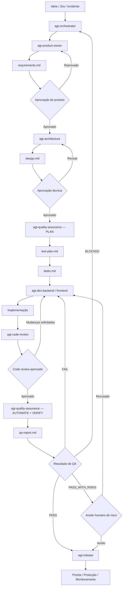
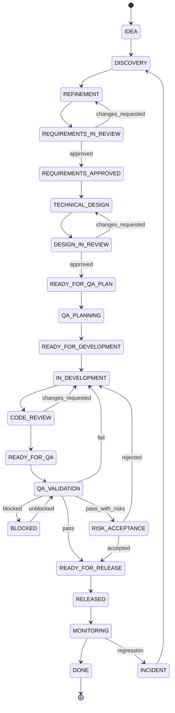

# Guia de Evolução do Fluxo de Features com Agents

> Proposta de processo orientado por especificação para conduzir uma demanda desde a ideia inicial até uma entrega validada, rastreável e pronta para produção.

---

## 1. Objetivo deste documento

Este documento define como organizar uma esteira de desenvolvimento baseada em agents especializados, com responsabilidades claras, limites de atuação e artefatos versionados.

A proposta cobre o ciclo completo de uma feature:

```text
Ideia
  ↓
Entendimento do problema
  ↓
Refinamento de produto
  ↓
Aprovação dos requisitos
  ↓
Desenho técnico
  ↓
Planejamento de qualidade
  ↓
Implementação
  ↓
Revisão técnica
  ↓
Validação de QA
  ↓
Pronta para produção
  ↓
Acompanhamento do resultado
```

O objetivo não é apenas gerar código com inteligência artificial.

O objetivo é criar um processo no qual cada agent:

- Possua uma responsabilidade específica.
- Trabalhe sobre uma fonte de verdade comum.
- Não ultrapasse os limites de sua função.
- Produza um artefato consumível pelo próximo agent.
- Registre decisões, riscos e evidências.
- Permita rastrear uma necessidade de negócio até o teste que comprovou sua entrega.

A unidade principal de trabalho deixa de ser somente uma task técnica e passa a ser uma **entrega de valor para o produto e para a empresa**.

---

## 2. Problema que esta proposta resolve

Quando agents são criados apenas como prompts independentes, alguns problemas aparecem rapidamente:

- O Product Owner cria requisitos com decisões técnicas indevidas.
- O desenvolvimento começa antes de o comportamento esperado estar claro.
- O QA testa o que foi implementado, em vez de testar o que foi aprovado.
- Agents diferentes usam terminologias e identificadores diferentes.
- Uma mudança em uma regra não é propagada para testes e tasks.
- O código passa a ser tratado como única fonte de verdade.
- A IA preenche lacunas com suposições não aprovadas.
- Não existe um critério objetivo para saber quando a feature está pronta.
- Um agent modifica arquivos que deveriam pertencer a outro papel.
- O resultado final pode estar tecnicamente correto, mas não entregar valor de negócio.

A solução é estruturar a operação em torno de quatro elementos:

1. **Agents**
2. **Skills**
3. **Templates**
4. **Gates de aprovação**

---

## 3. Conceitos fundamentais

### 3.1 Agent

Um agent representa um papel dentro do processo.

Ele deve definir:

- Qual é sua responsabilidade.
- Quando deve ser ativado.
- Quais arquivos pode ler.
- Quais arquivos pode alterar.
- Quais decisões pode tomar.
- Quais decisões não pode tomar.
- Qual skill deve seguir.
- Qual artefato deve produzir.
- Qual é seu contrato de handoff.
- Em qual condição deve interromper o fluxo.

Exemplos:

```text
agt-product-owner
agt-architecture
agt-quality-assurance
agt-dev-backend
agt-code-review
agt-release
agt-orchestrator
```

O agent não deve conter todos os detalhes operacionais de uma disciplina. Ele deve apontar para uma skill.

---

### 3.2 Skill

Uma skill representa um procedimento reutilizável.

Ela explica:

- Como executar uma atividade.
- Quais etapas devem ser seguidas.
- Quais perguntas devem ser feitas.
- Como avaliar a qualidade do resultado.
- Quais anti-patterns devem ser evitados.
- Quais critérios bloqueiam o avanço.
- Como produzir o artefato esperado.

Exemplos:

```text
skill-product-refinement
skill-technical-design
skill-quality-assurance
skill-backend-implementation
skill-code-review
skill-release-readiness
```

Enquanto o agent responde **quem faz**, a skill responde **como fazer**.

---

### 3.3 Template

O template padroniza o formato do artefato produzido.

Exemplos:

```text
requirements.md
design.md
tasks.md
test-plan.md
qa-report.md
release-report.md
```

O template reduz variações entre agents e facilita a leitura por humanos e por outros agents.

---

### 3.4 Gate

Um gate é uma condição obrigatória antes de a feature avançar.

Exemplos:

- Requisitos aprovados antes do desenvolvimento.
- Design aprovado antes de alterar múltiplos serviços.
- Critérios de aceite mapeados antes da automação de testes.
- Testes críticos aprovados antes da liberação.
- Contrato OpenAPI atualizado antes de considerar uma rota pronta.

Um gate não precisa significar burocracia. Ele significa que decisões importantes não devem ser assumidas silenciosamente.

---

## 4. Princípios do processo

### 4.1 Toda feature deve começar pelo problema, não pela solução

Pedido recebido:

```text
Adicionar scheduledBy no appointment.
```

Problema real:

```text
A empresa precisa identificar quem realizou o agendamento para manter
rastreabilidade, auditoria e métricas de produtividade do backoffice.
```

A primeira frase é uma possível solução técnica.

A segunda frase é o motivo de produto.

O PO deve refinar a segunda antes que o desenvolvimento decida como implementar a primeira.

---

### 4.2 Código não é automaticamente a fonte de verdade do produto

O código é evidência do comportamento atual.

Ele não prova que:

- O comportamento está correto.
- A regra ainda é válida.
- O produto deseja manter esse comportamento.
- Um bug antigo deve ser formalizado como requisito.

A precedência recomendada é:

1. Decisão explícita do responsável pelo produto.
2. Especificação aprovada.
3. Documentação oficial de negócio.
4. Jira e decisões relacionadas.
5. Contrato público da API.
6. Código atual como evidência do comportamento existente.
7. Hipótese explicitamente registrada.

---

### 4.3 Agents não devem esconder incertezas

Toda informação relevante deve ser classificada como:

- **Confirmed**: confirmada por fonte válida.
- **Assumption**: hipótese provisória.
- **Open question**: decisão ainda necessária.
- **Decision**: decisão aprovada.
- **Conflict**: divergência entre fontes.

Uma hipótese nunca deve aparecer como regra definitiva.

---

### 4.4 A feature deve ser dividida por valor, não somente por camada

Divisão ruim:

```text
Task 1: criar schema
Task 2: criar repository
Task 3: criar controller
Task 4: criar teste
```

Essa divisão descreve trabalho técnico, mas não deixa claro quando um valor de negócio foi entregue.

Divisão melhor:

```text
Slice 1:
Armazenar e retornar o responsável por novos agendamentos realizados pelo backoffice.

Slice 2:
Disponibilizar a informação em consultas operacionais.

Slice 3:
Usar os dados para métricas de produtividade.

Slice 4:
Realizar backfill de agendamentos históricos, se necessário.
```

Cada slice deve ter comportamento observável e critérios próprios.

---

### 4.5 Qualidade começa antes do código

O QA não deve participar apenas depois da implementação.

No modo de planejamento, o QA pode identificar antes do desenvolvimento:

- Critérios impossíveis de testar.
- Regras contraditórias.
- Falta de comportamento para usuários sem permissão.
- Ausência de regras para estados inválidos.
- Falta de decisão sobre idempotência.
- Contratos incompletos.
- Riscos de compatibilidade.
- Dados necessários para teste.

Esse processo é conhecido como **shift-left quality**.

---

### 4.6 Aprovação humana continua sendo necessária

Os agents podem:

- Propor.
- Analisar.
- Especificar.
- Implementar.
- Testar.
- Identificar riscos.

Entretanto, decisões relevantes de produto, risco e release devem permanecer sob autoridade humana ou de um orchestrator explicitamente autorizado.

---

## 5. Arquitetura proposta para os agents



---

## 6. Agents recomendados

### 6.1 `agt-orchestrator`

Responsável por conduzir a máquina de estados da feature.

Não deve escrever requisitos, código ou testes diretamente.

Deve:

- Identificar qual agent precisa atuar.
- Verificar se o gate anterior foi cumprido.
- Fornecer ao agent o caminho dos artefatos corretos.
- Impedir que fases sejam puladas.
- Consolidar bloqueios.
- Atualizar o status geral da feature.
- Encaminhar defeitos para o owner correto.
- Diferenciar revisão solicitada de aprovação efetiva.

---

### 6.2 `agt-product-owner`

Responsável por definir:

- Problema.
- Contexto.
- Atores.
- Resultado esperado.
- Regras de negócio.
- Fluxos.
- Critérios de aceite.
- Requisitos não funcionais de produto.
- Riscos.
- Métricas.
- Out of scope.
- Hipóteses e perguntas abertas.

Não deve:

- Implementar.
- Escolher banco.
- Definir classe.
- Definir schema.
- Escolher biblioteca.
- Editar código.
- Aprovar o próprio documento.

Artefato principal:

```text
docs/specs/<feature-slug>/requirements.md
```

---

### 6.3 `agt-architecture`

Responsável por transformar requisitos aprovados em um desenho técnico compatível com a arquitetura.

Deve considerar:

- Contextos afetados.
- Fluxo ponta a ponta.
- Camadas envolvidas.
- Contratos internos e externos.
- Estado e persistência.
- Compatibilidade.
- Eventos.
- Idempotência.
- Observabilidade.
- Migração e rollout.
- Dependências entre serviços.
- Estratégia de rollback.
- Riscos técnicos.

Artefato principal:

```text
docs/specs/<feature-slug>/design.md
```

Não deve alterar requisitos de produto silenciosamente. Quando o requisito for inviável ou contraditório, deve devolver uma pergunta ao PO.

---

### 6.4 `agt-quality-assurance`

Responsável por qualidade em três modos:

#### PLAN

Antes da implementação:

```text
requirements.md + design.md
               ↓
          test-plan.md
```

#### AUTOMATE

Durante ou depois da implementação:

```text
test-plan.md + código
          ↓
src/__tests__/**
```

#### VERIFY

Depois da implementação:

```text
testes + comandos + evidências
                ↓
           qa-report.md
```

O QA deve testar requisitos, e não justificar a implementação.

---

### 6.5 `agt-dev-backend`

Responsável por implementar as tasks aprovadas.

Deve:

- Ler `requirements.md`.
- Ler `design.md`.
- Ler `test-plan.md`.
- Respeitar a ordem de tasks.
- Manter rastreabilidade com `AC-*` e `TASK-*`.
- Respeitar a arquitetura em camadas.
- Atualizar contratos quando o design exigir.
- Criar testes de desenvolvimento quando definidos pelo fluxo.
- Não expandir escopo por conta própria.
- Registrar desvios técnicos.

Não deve reinterpretar regras ambíguas. Deve devolver a decisão ao PO ou arquitetura.

---

### 6.6 `agt-code-review`

Responsável por revisar:

- Correção.
- Aderência aos requisitos.
- Aderência ao design.
- Limites entre camadas.
- Complexidade.
- Segurança.
- Compatibilidade.
- Testabilidade.
- Observabilidade.
- Tratamento de erros.
- Cobertura de testes.
- Mudanças fora do escopo.

Deve separar:

- Defeito funcional.
- Violação arquitetural.
- Melhoria não bloqueante.
- Preferência pessoal.

---

### 6.7 `agt-release`

Responsável por validar prontidão operacional.

Deve verificar:

- Resultado do QA.
- Riscos residuais.
- Migrações.
- Variáveis de ambiente.
- Contratos.
- Observabilidade.
- Dashboards e alertas.
- Compatibilidade.
- Estratégia de rollout.
- Rollback.
- Comunicação.
- Métrica de sucesso.

---

## 7. Estrutura de diretórios recomendada

```text
.cursor/
├── agents/
│   ├── agt-orchestrator.md
│   ├── agt-product-owner.md
│   ├── agt-architecture.md
│   ├── agt-quality-assurance.md
│   ├── agt-dev-backend.md
│   ├── agt-code-review.md
│   └── agt-release.md
│
├── skills/
│   ├── skill-spec-driven/
│   │   └── SKILL.md
│   ├── skill-product-refinement/
│   │   └── SKILL.md
│   ├── skill-technical-design/
│   │   └── SKILL.md
│   ├── skill-quality-assurance/
│   │   └── SKILL.md
│   ├── skill-backend-implementation/
│   │   └── SKILL.md
│   ├── skill-code-review/
│   │   └── SKILL.md
│   └── skill-release-readiness/
│       └── SKILL.md
│
├── SPECS.md
├── JIRA.md
└── WORKFLOW.md

docs/
├── architecture-and-layers.md
└── specs/
    ├── README.md
    ├── _templates/
    │   ├── requirements.md
    │   ├── design.md
    │   ├── tasks.md
    │   ├── test-plan.md
    │   ├── qa-report.md
    │   └── release-report.md
    └── <feature-slug>/
        ├── requirements.md
        ├── design.md
        ├── tasks.md
        ├── test-plan.md
        ├── qa-report.md
        └── release-report.md
```

---

## 8. Máquina de estados da feature

Toda feature deve possuir um estado único e explícito.



### Estados mínimos

| Estado | Significado | Owner |
|---|---|---|
| `IDEA` | Pedido ainda não refinado | Solicitante |
| `DISCOVERY` | Problema e contexto em análise | PO |
| `REFINEMENT` | Requisitos em construção | PO |
| `REQUIREMENTS_IN_REVIEW` | Requisitos aguardando aprovação | Humano responsável |
| `REQUIREMENTS_APPROVED` | Comportamento aprovado | Produto |
| `TECHNICAL_DESIGN` | Solução técnica em construção | Arquitetura |
| `READY_FOR_QA_PLAN` | Design suficientemente definido | Arquitetura |
| `QA_PLANNING` | Casos de teste sendo derivados | QA |
| `READY_FOR_DEVELOPMENT` | Requisitos, design e testes planejados | Orchestrator |
| `IN_DEVELOPMENT` | Implementação em andamento | Desenvolvimento |
| `CODE_REVIEW` | Revisão técnica | Reviewer |
| `READY_FOR_QA` | Implementação disponível para validação | Desenvolvimento |
| `QA_VALIDATION` | Testes e verificações em execução | QA |
| `BLOCKED` | Validação impedida | Orchestrator |
| `READY_FOR_RELEASE` | Gates de qualidade concluídos | Release |
| `RELEASED` | Entregue em produção | Release |
| `MONITORING` | Métricas e regressões acompanhadas | Produto/Engenharia |
| `DONE` | Resultado concluído | Produto |

---

## 9. Metadados padronizados da feature

Recomenda-se manter um arquivo ou frontmatter comum:

```yaml
feature: appointment-scheduled-by
title: Registrar responsável pelo agendamento
status: REQUIREMENTS_IN_REVIEW
version: 0.1.0
productOwner: product
technicalOwner: backend
qaOwner: quality-assurance
jira: ST-0000
createdAt: YYYY-MM-DD
updatedAt: YYYY-MM-DD
requirementsApproval: pending
designApproval: not_started
qaResult: not_started
releaseDecision: not_started
```

O orchestrator deve usar esses valores para decidir o próximo passo.

---

# Parte II — Fluxo completo da feature

## 10. Etapa 0 — Entrada da ideia

### 10.1 Fontes possíveis

A demanda pode surgir de:

- Estratégia da empresa.
- Feedback de usuário.
- Operação.
- Suporte.
- Dados.
- Incidente.
- Auditoria.
- Solicitação técnica.
- Jira.
- Ideia em conversa.
- Necessidade regulatória.
- Otimização de custo.
- Problema de performance.

### 10.2 Informações mínimas de entrada

Mesmo uma ideia inicial deve tentar responder:

```md
## Problema

O que está acontecendo ou deixando de acontecer?

## Impacto

Quem é afetado e qual consequência existe?

## Resultado desejado

O que deveria ser possível depois da entrega?

## Evidências

Existem exemplos, dados, prints, erros ou relatos?

## Restrições conhecidas

Existe prazo, compliance, dependência ou limitação?

## Fora do escopo conhecido

O que explicitamente não faz parte desta solicitação?
```

Não é necessário que a entrada já esteja completa. Essa estrutura serve para evitar solicitações formadas apenas por uma solução técnica.

### 10.3 Gate de entrada

A ideia pode seguir para o PO quando:

- Existe um problema ou oportunidade identificável.
- Existe um solicitante ou owner.
- O objetivo não é somente “alterar código”.
- Há contexto suficiente para iniciar discovery.

---

## 11. Etapa 1 — Agent Product Owner

### 11.1 Objetivo

Transformar uma solicitação vaga em uma especificação:

- Clara.
- Versionada.
- Rastreável.
- Testável.
- Independente do chat original.
- Orientada a resultado.

### 11.2 O que o PO deve fazer

1. Ler a solicitação.
2. Buscar especificações relacionadas.
3. Entender o comportamento atual.
4. Identificar o problema de produto.
5. Identificar atores.
6. Separar regra de negócio de sugestão técnica.
7. Identificar perguntas realmente necessárias.
8. Perguntar no máximo cinco questões por rodada.
9. Registrar hipóteses não bloqueantes.
10. Bloquear regras financeiras, jurídicas ou críticas sem decisão.
11. Propor o menor slice de valor.
12. Criar ou atualizar `requirements.md`.
13. Executar a Definition of Ready.
14. Solicitar aprovação humana.

### 11.3 O que o PO não deve fazer

- Escolher MongoDB ou PostgreSQL.
- Decidir nome de collection.
- Definir controller.
- Definir endpoint sem necessidade de produto.
- Definir estrutura interna de evento.
- Implementar.
- Criar teste.
- Marcar o próprio documento como aprovado.
- Inventar regra para preencher lacuna.

### 11.4 Conteúdo obrigatório de `requirements.md`

```text
Metadata
Context
Problem or opportunity
Business impact
Objective
Actors
User stories
Business rules
Main flow
Alternative flows
Failure flows
Acceptance criteria
Non-functional requirements
Out of scope
Dependencies
Risks
Metrics
Assumptions
Open questions
Decisions
Links
Definition of Ready
Changelog
```

### 11.5 Identificadores

```text
OBJ-01    objetivo
ACT-01    ator
US-01     user story
BR-01     regra de negócio
FLOW-01   fluxo
AC-01     critério de aceite
NFR-01    requisito não funcional
ASM-01    hipótese
RQ-01     pergunta
RISK-01   risco
METRIC-01 métrica
DEC-01    decisão
```

### 11.6 Critério de aceite correto

Ruim:

```text
AC-01: Adicionar scheduledBy no banco.
```

Melhor:

```md
### AC-01 — Registrar o responsável pelo agendamento

Traceability:
- US-01
- BR-01

Given um appointment elegível para agendamento
And um operador autenticado do backoffice realiza a ação
When o status do appointment muda para SCHEDULED
Then o sistema deve reter o identificador do operador responsável
And a informação deve permanecer disponível para auditoria
```

A segunda versão permite diferentes soluções técnicas sem perder o comportamento esperado.

### 11.7 Gate de saída do PO

A feature só deve seguir quando:

- O problema está claro.
- O valor esperado está claro.
- Os atores estão claros.
- As regras críticas foram confirmadas.
- Os critérios são testáveis.
- Casos inválidos relevantes estão cobertos.
- O out of scope está explícito.
- Não existem perguntas bloqueantes ocultas.
- O documento foi aprovado por uma pessoa autorizada.

Resultado:

```text
REQUIREMENTS_APPROVED
```

---

## 12. Etapa 2 — Aprovação de produto

A aprovação não deve ser apenas “ok”.

O aprovador deve confirmar:

- Esse é o problema correto?
- Esse é o resultado esperado?
- As regras representam o negócio?
- Os critérios podem ser usados como contrato?
- O out of scope está correto?
- As hipóteses são aceitáveis?
- Os riscos são conhecidos?
- A métrica demonstra sucesso?

Formato recomendado:

```md
Approval:
- Status: APPROVED
- Approved by: <responsável>
- Date: <YYYY-MM-DD>
- Approved version: <version>
- Conditions: <nenhuma ou lista>
```

Quando houver mudança posterior, a versão deve ser incrementada.

---

## 13. Etapa 3 — Agent de Arquitetura

### 13.1 Objetivo

Definir **como a capacidade será implementada**, sem mudar silenciosamente **o que deve acontecer**.

### 13.2 Entradas

```text
requirements.md aprovado
arquitetura do projeto
contratos existentes
código atual
restrições operacionais
```

### 13.3 Análise obrigatória

- Fluxo completo da requisição ou evento.
- Serviços afetados.
- Camadas afetadas.
- Ownership dos dados.
- Contratos internos.
- OpenAPI.
- Eventos Kafka.
- Persistência.
- Compatibilidade de registros antigos.
- Idempotência.
- Concorrência.
- Erros.
- Observabilidade.
- Segurança.
- Migração.
- Rollout.
- Rollback.
- Impactos operacionais.

### 13.4 Aplicação à arquitetura em camadas

#### Domain

Deve conter:

- Entidades.
- Interfaces `I*`.
- Regras de negócio.
- Services.
- Contratos de repository.
- Contratos Kafka.
- Erros de domínio.

Não pode importar:

- Mongoose.
- Models concretos.
- `IM*`.
- Implementações Kafka.
- Arquivos de `infraestructure`.

#### Application

Deve conter:

- Controller.
- Extração de `req`.
- Retorno de `res`.
- Middlewares da rota.
- Delegação ao service.
- Tradução de erro no limite HTTP.

Não deve conter regra de negócio ou acesso direto ao banco.

#### Infraestructure

Deve conter:

- Model e schema MongoDB.
- Interface `IM*`.
- Repository concreto.
- Adapter.
- Producer/consumer concreto.
- Cliente HTTP.
- i18n técnico.

Não deve decidir:

- Regra de elegibilidade.
- Erro de negócio.
- Transição de estado.
- Autorização de produto.

#### Configuration

Deve:

- Instanciar.
- Injetar.
- Compor o grafo.

Não deve conter regra.

#### Contracts

Deve manter `service.yaml` alinhado ao comportamento externo.

#### Tests

Devem permanecer em `src/__tests__`.

### 13.5 Artefato

```text
docs/specs/<feature-slug>/design.md
```

### 13.6 Gate de saída

O design pode seguir quando:

- Todos os `AC-*` possuem suporte técnico.
- Não existe regra de produto redefinida.
- Ownership está claro.
- Compatibilidade foi considerada.
- Eventos e contratos foram definidos.
- Riscos técnicos estão registrados.
- Estratégia de teste é viável.
- Migração e rollout foram tratados quando necessários.
- O design foi aprovado.

---

## 14. Etapa 4 — QA em modo PLAN

### 14.1 Objetivo

Converter critérios aprovados em uma estratégia de validação antes do desenvolvimento.

### 14.2 O QA deve identificar

- Casos positivos.
- Casos negativos.
- Limites.
- Permissões.
- Estados válidos.
- Estados inválidos.
- Repetição.
- Idempotência.
- Compatibilidade.
- Persistência.
- Eventos.
- Erros.
- Regressões.
- Riscos operacionais.
- Dados de teste.
- Dependências de ambiente.

### 14.3 Níveis de teste

#### Unitário de Domain

Usado para:

- Regras.
- Services.
- Entities.
- Validação.
- Transições.
- Erros.
- Interação com interfaces.
- Ordem de persistência e evento.

#### Controller/Application

Usado para:

- Entrada HTTP.
- Status.
- Payload.
- Delegação.
- Tradução de erros.
- Wiring de middleware.

#### Integração de Infraestructure

Usado para:

- Query MongoDB.
- Schema.
- Adapter.
- Repository.
- Compatibilidade de documentos.
- Índices.
- `null` versus encontrado.

#### Contrato

Usado para:

- OpenAPI.
- Request.
- Response.
- Campos obrigatórios.
- Status.
- Compatibilidade.

#### Mensageria

Usado para:

- `messageType`.
- Payload.
- Condição de publicação.
- Ausência de publicação no erro.
- Retry.
- Idempotência.
- Dispatch do consumer.

#### Configuration

Usado para:

- Composição do grafo.
- Injeção correta.
- Construção de factories.

### 14.4 Artefato

```text
docs/specs/<feature-slug>/test-plan.md
```

### 14.5 Identificadores

```text
TC-01 Test Case
DEF-01 Defect
ARCH-01 Architecture Finding
```

### 14.6 Gate de saída

O desenvolvimento pode iniciar quando:

- Todos os critérios críticos possuem caso de teste planejado.
- Prioridades P0 e P1 estão identificadas.
- O ambiente necessário está conhecido.
- Casos bloqueados foram devolvidos ao PO.
- Não há critério impossível de validar.
- A estratégia não depende de produção.
- O test plan foi aceito pelo fluxo.

Resultado:

```text
READY_FOR_DEVELOPMENT
```

---

## 15. Etapa 5 — Criação de tasks

As tasks devem ser criadas depois de requisitos, design e planejamento de QA.

Cada task precisa indicar:

```md
### TASK-01 — <resultado>

Traceability:
- AC-01
- BR-01
- TC-01

Owner:
- backend

Dependencies:
- TASK-00

Expected files/layers:
- Domain
- Infraestructure

Completion check:
- <evidência observável>
```

### 15.1 Regras para tasks

- Devem ser pequenas.
- Devem possuir resultado.
- Devem ser ordenadas.
- Devem apontar para critérios.
- Não devem criar comportamento fora do requisito.
- Não devem usar “implementar feature” como task genérica.
- Devem explicitar dependências.
- Devem incluir atualização de contrato quando necessário.
- Devem incluir observabilidade quando necessária.
- Devem incluir testes correspondentes.

### 15.2 Ordem típica de backend

Uma ordem possível, sem transformá-la em regra absoluta:

```text
1. Contratos e interfaces de Domain
2. Regra/entity/service
3. Contratos de repository ou messaging
4. Persistência e adapters
5. Implementações concretas
6. Application/controller
7. Factories
8. OpenAPI
9. Testes
10. Observabilidade
11. Migração/compatibilidade
```

A ordem pode mudar de acordo com a estratégia de teste e o risco.

---

## 16. Etapa 6 — Desenvolvimento

### 16.1 Entradas obrigatórias

O agent de desenvolvimento deve receber:

```text
requirements.md aprovado
design.md aprovado
tasks.md
test-plan.md
arquitetura do projeto
```

### 16.2 Regras de desenvolvimento

- Implementar somente o slice aprovado.
- Não criar comportamento novo sem decisão.
- Manter controllers finos.
- Manter regra no Domain.
- Dependência de repository por contrato.
- Implementação concreta em Infraestructure.
- Adapters puros.
- Factories apenas para composição.
- OpenAPI sincronizado.
- Eventos publicados somente nas condições aprovadas.
- Testes determinísticos.
- Logs sem dados sensíveis.
- Compatibilidade explícita.
- Erros consistentes.
- Nenhum segredo no código.
- Nenhuma chamada destrutiva em produção.

### 16.3 Desvios durante a implementação

Quando o desenvolvimento descobrir uma lacuna:

```text
Regra de negócio ausente
    → PO

Impossibilidade ou risco técnico
    → Arquitetura

Critério impossível de testar
    → QA + PO

Mudança necessária fora do escopo
    → Orchestrator + PO

Dependência externa indisponível
    → Orchestrator
```

O agent não deve resolver divergências de produto por inferência silenciosa.

### 16.4 Definition of Done do desenvolvimento

Antes de enviar para code review:

- Tasks concluídas.
- Build executável.
- Testes direcionados passando.
- Lint passando.
- Type check passando.
- Contrato atualizado.
- Nenhuma alteração não relacionada.
- Traceability atualizada.
- Limitações registradas.
- Logs e observabilidade incluídos quando exigidos.
- Sem mudança silenciosa nos requisitos.

---

## 17. Etapa 7 — Code Review

### 17.1 O reviewer deve comparar

```text
Requisitos
   ↕
Design
   ↕
Tasks
   ↕
Implementação
   ↕
Testes
```

### 17.2 Categorias de findings

```text
BLOCKING_FUNCTIONAL
BLOCKING_ARCHITECTURE
BLOCKING_SECURITY
BLOCKING_CONTRACT
NON_BLOCKING_IMPROVEMENT
STYLE
QUESTION
```

### 17.3 Checklist arquitetural

- Domain importa Infraestructure?
- Controller contém regra?
- Controller acessa model?
- Repository lança erro de produto?
- Adapter contém regra?
- Factory contém condição de negócio?
- `IM*` vazou para Domain?
- Contrato externo foi atualizado?
- Evento foi definido no lugar correto?
- O código está testável?
- Há duplicação de regra?
- O fluxo de erro está consistente?
- O escopo foi expandido?
- Existe risco de compatibilidade?
- Existe risco de concorrência?
- Existe log ou dado sensível?

### 17.4 Gate de saída

Somente depois dos findings bloqueantes resolvidos:

```text
READY_FOR_QA
```

---

## 18. Etapa 8 — QA em modo AUTOMATE e VERIFY

### 18.1 AUTOMATE

O QA deve:

- Ler requirements.
- Ler test plan.
- Ler implementação.
- Mapear `TC-*` para arquivos.
- Criar testes no menor nível efetivo.
- Reutilizar builders e fixtures.
- Evitar duplicação entre níveis.
- Não mudar produção para fazer teste passar.
- Preservar evidência de defeito.

### 18.2 VERIFY

Ordem recomendada:

```text
1. Teste direcionado
2. Suite do módulo
3. Testes de integração
4. Validação de contrato
5. Suite completa
6. Coverage
7. Type check
8. Lint
9. Format check
10. Build
```

Os comandos reais devem ser descobertos no `package.json`.

### 18.3 Resultado de QA

#### PASS

- P0 e P1 passam.
- Não há defeito blocker, critical ou major não aceito.
- Gates obrigatórios passam.
- Evidências estão registradas.
- Não há violação arquitetural bloqueante.

#### PASS_WITH_RISKS

- Comportamento principal passa.
- Existem riscos ou defects menores conhecidos.
- Os riscos foram explicitados.
- É necessária aceitação humana.

#### FAIL

- Critério obrigatório falha.
- Existe regressão.
- Contrato foi quebrado.
- Existe defeito crítico.
- Existe violação arquitetural material.

#### BLOCKED

- Ambiente indisponível.
- Dependência ausente.
- Regra não decidida.
- Credencial segura indisponível.
- Dados de teste insuficientes.
- Teste não pode ser executado com segurança.

### 18.4 Artefato

```text
docs/specs/<feature-slug>/qa-report.md
```

---

## 19. Etapa 9 — Release readiness

A feature não deve ser considerada pronta apenas porque o código foi mergeado.

Checklist:

### Produto

- Requisitos aprovados.
- Métrica definida.
- Comunicação preparada quando necessária.
- Riscos aceitos.

### Engenharia

- PR aprovado.
- Build aprovado.
- Migração validada.
- Configurações preparadas.
- Contratos compatíveis.
- Rollback definido.
- Feature flag definida quando necessária.

### QA

- Resultado aceitável.
- Defeitos registrados.
- Regressão executada.
- Evidências disponíveis.

### Operação

- Logs.
- Métricas.
- Dashboards.
- Alertas.
- Runbook.
- Responsável pelo acompanhamento.

### Segurança

- Permissões.
- Dados sensíveis.
- Segredos.
- Auditoria.
- Dependências.

Resultado:

```text
READY_FOR_RELEASE
```

---

## 20. Etapa 10 — Produção e acompanhamento

Uma entrega só demonstra valor depois de observada.

O acompanhamento deve responder:

- A feature está sendo usada?
- O problema foi reduzido?
- A métrica melhorou?
- Surgiram erros?
- Houve regressão?
- A operação recebeu a informação necessária?
- A hipótese de produto foi validada?
- O custo técnico ficou dentro do esperado?

A spec pode receber uma seção posterior:

```md
## Outcome review

- Release date:
- Measurement period:
- Expected metric:
- Actual result:
- Incidents:
- Lessons:
- Follow-up decisions:
```

---

# Parte III — Rastreabilidade

## 21. Cadeia de rastreabilidade

```text
OBJ-01
└── US-01
    ├── BR-01
    ├── FLOW-01
    └── AC-01
        ├── NFR-01
        ├── TC-01
        ├── TASK-01
        ├── src/__tests__/...spec.ts
        └── QA execution evidence
```

### 21.1 Por que isso é importante

Permite responder:

- Qual necessidade justifica este código?
- Qual regra este teste protege?
- Qual critério falhou?
- Qual task introduziu a alteração?
- Quais testes precisam mudar quando uma regra muda?
- Qual requisito não possui cobertura?
- Qual defeito impede a release?

---

## 22. Matriz de rastreabilidade recomendada

```md
| Requirement | Business rule | Acceptance criterion | Test case | Task | Test file | Result |
|---|---|---|---|---|---|---|
| US-01 | BR-01 | AC-01 | TC-01 | TASK-01 | appointment.service.spec.ts | PASS |
```

A matriz pode ficar em `test-plan.md` ou ser gerada pelo orchestrator.

---

# Parte IV — Contratos de handoff

## 23. Handoff do PO

```md
Result: SPEC_CREATED | SPEC_UPDATED | BLOCKED
Status: Draft | In Review
Feature slug: <slug>

Artifacts:
- docs/specs/<slug>/requirements.md

Traceability:
- Stories: US-01
- Business rules: BR-01
- Acceptance criteria: AC-01
- NFRs: NFR-01

Assumptions:
- ASM-01

Blocking questions:
- none

Approval required:
- Human product approval
```

---

## 24. Handoff da arquitetura

```md
Result: DESIGN_CREATED | DESIGN_UPDATED | BLOCKED
Feature slug: <slug>

Artifacts:
- docs/specs/<slug>/design.md

Requirements covered:
- AC-01
- NFR-01

Affected contexts:
- st-appointment-service

Affected layers:
- Domain
- Infraestructure
- Contracts

Compatibility:
- Backward compatible

Open technical decisions:
- none

Approval required:
- Technical approval
```

---

## 25. Handoff do QA PLAN

```md
QA result: PLAN_CREATED | PLAN_UPDATED | BLOCKED
Feature slug: <slug>

Artifacts:
- docs/specs/<slug>/test-plan.md

Coverage:
- AC-01 → TC-01, TC-02
- NFR-01 → TC-03

Priorities:
- P0: TC-01
- P1: TC-02

Blockers:
- none

Next owner:
- agt-dev-backend
```

---

## 26. Handoff de desenvolvimento

```md
Implementation result: COMPLETED | PARTIAL | BLOCKED
Feature slug: <slug>

Tasks:
- TASK-01: completed
- TASK-02: completed

Acceptance criteria implemented:
- AC-01

Files changed:
- <paths>

Commands:
- <command>: PASS

Deviations:
- none

Risks:
- none

Next owner:
- agt-code-review
```

---

## 27. Handoff do QA VERIFY

```md
QA result: PASS | PASS_WITH_RISKS | FAIL | BLOCKED
Feature slug: <slug>

Artifacts:
- docs/specs/<slug>/qa-report.md

Acceptance criteria:
- AC-01: PASS

Automated tests:
- src/__tests__/...

Commands:
- yarn test ...: PASS
- yarn test:coverage: PASS
- yarn lint: PASS

Defects:
- none

Architecture findings:
- none

Residual risks:
- none

Next owner:
- agt-release
```

---

# Parte V — Melhorias recomendadas na estrutura atual

## 28. Criar um orchestrator explícito

### Problema

Sem orchestrator, cada agent precisa decidir sozinho:

- Qual é o próximo passo.
- Se a etapa anterior está aprovada.
- Qual documento deve consumir.
- Se pode iniciar implementação.
- Para quem devolver um bloqueio.

### Melhoria

Criar `agt-orchestrator` com uma máquina de estados.

Ele deve impedir:

- Desenvolvimento antes da aprovação.
- QA sem requirements.
- Release sem QA.
- PO alterando código.
- QA alterando produção.
- Dev alterando requisito aprovado.
- Code review substituindo aprovação de produto.

---

## 29. Criar um contrato comum de metadados

### Problema

Cada documento pode utilizar status e versões diferentes.

### Melhoria

Padronizar:

```yaml
feature:
status:
version:
owner:
jira:
createdAt:
updatedAt:
approvedBy:
approvedAt:
```

Os agents devem ler e preservar esses dados.

---

## 30. Separar aprovação de revisão solicitada

### Problema

“Revise o documento” pode ser interpretado como “aprovado”.

### Melhoria

Aceitar somente decisões explícitas:

```text
APPROVED
CHANGES_REQUESTED
REJECTED
BLOCKED
```

Comentários ou elogios não devem mudar automaticamente o estado.

---

## 31. Formalizar o loop de mudança de requisito

### Problema

Uma mudança durante o desenvolvimento pode deixar testes e tasks desatualizados.

### Melhoria

Quando um requisito aprovado mudar:

1. PO altera `requirements.md`.
2. Incrementa a versão.
3. Registra changelog.
4. Arquitetura realiza impact analysis.
5. QA atualiza test plan.
6. Tasks afetadas são atualizadas.
7. Desenvolvimento continua sobre a nova versão.
8. QA report informa qual versão foi validada.

Nenhum agent deve validar uma versão diferente da implementada.

---

## 32. Criar regras de bloqueio objetivas

### PO bloqueia quando

- Regra financeira é desconhecida.
- Regra legal é desconhecida.
- Actor e permissão são materialmente ambíguos.
- Comportamento destrutivo não está definido.
- Critérios se contradizem.

### Arquitetura bloqueia quando

- Ownership é indefinido.
- Não existe estratégia segura de compatibilidade.
- Requisito exige comportamento tecnicamente impossível sem alteração de produto.
- Dependência crítica é desconhecida.

### QA bloqueia quando

- Critério não possui resultado observável.
- Ambiente é inseguro.
- Credencial necessária não pode ser usada.
- Dados de teste não existem.
- Comportamento esperado está em conflito.

### Release bloqueia quando

- Não existe rollback para mudança de alto risco.
- Migração não foi validada.
- Não existe observabilidade mínima.
- QA falhou.
- Risco critical não foi aceito.

---

## 33. Distinguir defeito funcional de finding arquitetural

Defeito:

```text
O sistema não registra o operador quando o status muda para SCHEDULED.
```

Finding arquitetural:

```text
O controller acessa AppointmentModel diretamente e duplica a regra do service.
```

Os dois podem coexistir e devem ter owners diferentes.

---

## 34. Incluir compatibilidade e migração em toda mudança de dados

Sempre que um novo campo for adicionado:

- Ele é obrigatório ou opcional?
- Registros antigos continuam válidos?
- Existe default?
- Será feito backfill?
- A API pode retornar ausência?
- Consumers antigos toleram o novo payload?
- Índice será necessário?
- O rollout precisa ser em duas fases?
- O rollback é seguro?

Essa análise não deve ficar implícita.

---

## 35. Formalizar política de testes

Recomendações:

- Coverage mínimo de 80% como piso.
- Branches críticas precisam de cobertura explícita.
- Preferência por `describe('when ...')` e `it('should ...')`.
- Sem dependência de ordem.
- Sem `sleep` arbitrário.
- Sem rede real em testes unitários.
- Sem credencial de produção.
- Mocks sobre interfaces.
- Teste no menor nível suficiente.
- Teste de integração para repository e adapter.
- Teste de contrato para mudanças externas.
- Teste de evento quando houver side effect Kafka.

---

## 36. Adicionar Definition of Ready e Definition of Done globais

### Definition of Ready

- Requirements aprovados.
- Design aprovado quando necessário.
- Test plan criado.
- Dependências conhecidas.
- Dados de teste planejados.
- Tasks rastreáveis.
- Sem pergunta bloqueante.
- Owner definido.

### Definition of Done

- Critérios implementados.
- Contratos atualizados.
- Testes automatizados.
- QA executado.
- Sem defeito bloqueante.
- Observabilidade disponível.
- Rollout definido.
- Riscos residuais aceitos.
- Métrica de sucesso preparada.
- Documentação atualizada.

---

# Parte VI — Exemplo completo

## 37. Exemplo: registrar quem agendou um appointment

### 37.1 Ideia inicial

```text
Quero vincular o ID de quem executa a ação de marcar um appointment no
backoffice. Quando o appointment passar para SCHEDULED, precisamos armazenar
quem realizou a ação para controlar produtividade.
```

### 37.2 Refinamento do PO

#### Problema

Atualmente, após um appointment ser agendado, a empresa não consegue identificar de forma confiável qual operador executou a ação.

#### Objetivo

Manter rastreabilidade do operador responsável por cada transição para `SCHEDULED`, permitindo auditoria e uso futuro em métricas operacionais.

#### Actors

```text
ACT-01 Backoffice operator
ACT-02 Operations manager
```

#### Business rules

```text
BR-01:
O responsável deve ser registrado quando um operador do backoffice efetivar
uma transição válida para SCHEDULED.

BR-02:
A informação deve representar o ator autenticado que realizou a ação.

BR-03:
Uma tentativa inválida de transição não deve registrar um responsável.

BR-04:
A mudança não inclui, neste slice, dashboard de produtividade.
```

#### Acceptance criteria

```md
AC-01:
Given um appointment está elegível para agendamento
And um operador autenticado realiza a ação
When o appointment muda para SCHEDULED
Then o identificador desse operador deve ser retido
And deve permanecer associado ao appointment

AC-02:
Given uma tentativa de transição para SCHEDULED é rejeitada
When a operação falha
Then nenhum novo responsável deve ser registrado

AC-03:
Given um appointment antigo não possui responsável registrado
When ele é consultado
Then o sistema deve manter compatibilidade com esse registro
And não deve inferir um operador inexistente
```

#### Out of scope

```text
- Dashboard de produtividade
- Backfill histórico
- Ranking de operadores
- Alteração de responsável
```

### 37.3 Design de arquitetura

Possível desenho:

```text
Domain
- Estender IAppointment com informação compatível
- Atualizar regra do service responsável pela transição
- Garantir que a identidade autenticada chegue ao service
- Manter contracts de repository

Application
- Extrair contexto autenticado
- Delegar a mudança ao service
- Não decidir a regra

Infraestructure
- Atualizar IMAppointment/schema
- Atualizar adapter
- Persistir o campo
- Manter leitura de registros antigos

Configuration
- Ajustar injeções somente se necessário

Contracts
- Atualizar OpenAPI se o dado for exposto externamente

Tests
- Unitários do service
- Integração do repository/adapter
- Controller/contract quando aplicável
```

### 37.4 QA PLAN

```text
TC-01 P0:
Transição válida registra o operador correto.

TC-02 P0:
Transição inválida não altera responsável.

TC-03 P1:
Registro antigo sem responsável continua sendo lido.

TC-04 P1:
Controller encaminha a identidade autenticada ao service.

TC-05 P1:
Repository persiste e recupera o dado por meio do adapter.

TC-06 P1:
Contrato retorna o campo conforme a decisão aprovada.

TC-07 P2:
Tentativa repetida respeita a decisão de idempotência.
```

### 37.5 Tasks

```text
TASK-01:
Atualizar contratos de Domain para representar o responsável.

TASK-02:
Aplicar a regra durante a transição para SCHEDULED.

TASK-03:
Atualizar persistência e adapters com compatibilidade retroativa.

TASK-04:
Encaminhar contexto autenticado pela Application.

TASK-05:
Atualizar contrato externo quando aplicável.

TASK-06:
Implementar testes planejados.

TASK-07:
Adicionar observabilidade necessária para falhas de atualização.
```

### 37.6 Critério de pronto

A feature está pronta quando:

- O operador correto é registrado.
- Falhas não deixam atualização parcial.
- Registros antigos continuam válidos.
- Contratos estão sincronizados.
- Testes P0 e P1 passam.
- Não existe violação de camada.
- QA report é `PASS`, ou riscos foram formalmente aceitos.
- A informação pode ser auditada.
- O dashboard continua fora do escopo desta entrega.

---

# Parte VII — Plano de implementação dos agents

## 38. Fase 1 — Fundação

Criar:

```text
agt-product-owner
agt-quality-assurance
skill-product-refinement
skill-quality-assurance
requirements.md template
test-plan.md template
qa-report.md template
docs/specs/README.md
.cursor/SPECS.md
```

Objetivo:

- Padronizar refinamento.
- Padronizar critérios.
- Padronizar QA.
- Criar rastreabilidade inicial.

---

## 39. Fase 2 — Arquitetura e desenvolvimento

Criar:

```text
agt-architecture
agt-dev-backend
agt-code-review
skill-technical-design
skill-backend-implementation
skill-code-review
design.md template
tasks.md template
```

Objetivo:

- Garantir aderência às camadas.
- Evitar decisões técnicas no PO.
- Evitar regra de negócio fora do Domain.
- Padronizar implementação e review.

---

## 40. Fase 3 — Orquestração

Criar:

```text
agt-orchestrator
.cursor/WORKFLOW.md
feature metadata/status contract
handoff schemas
approval rules
```

Objetivo:

- Automatizar o fluxo.
- Impedir avanço sem gate.
- Encaminhar bloqueios.
- Manter estado único.

---

## 41. Fase 4 — Release e métricas

Criar:

```text
agt-release
skill-release-readiness
release-report.md
outcome-review template
```

Objetivo:

- Validar prontidão operacional.
- Definir rollout e rollback.
- Medir resultado real da entrega.
- Fechar o ciclo de produto.

---

# Parte VIII — Checklist final

## 42. Checklist da ideia

- [ ] Existe um problema ou oportunidade.
- [ ] Existe impacto identificável.
- [ ] Existe owner.
- [ ] A solicitação não é apenas uma solução técnica.

## 43. Checklist do PO

- [ ] Problema documentado.
- [ ] Objetivo verificável.
- [ ] Atores identificados.
- [ ] Regras confirmadas.
- [ ] Fluxos relevantes.
- [ ] Critérios testáveis.
- [ ] Out of scope explícito.
- [ ] Hipóteses visíveis.
- [ ] Métrica definida.
- [ ] Aprovação humana registrada.

## 44. Checklist da arquitetura

- [ ] Contextos afetados.
- [ ] Fluxo ponta a ponta.
- [ ] Ownership.
- [ ] Camadas.
- [ ] Contratos.
- [ ] Persistência.
- [ ] Eventos.
- [ ] Compatibilidade.
- [ ] Idempotência.
- [ ] Erros.
- [ ] Observabilidade.
- [ ] Rollout e rollback.

## 45. Checklist do QA PLAN

- [ ] Todos os ACs críticos possuem TCs.
- [ ] Casos negativos.
- [ ] Permissões.
- [ ] Estados.
- [ ] Limites.
- [ ] Compatibilidade.
- [ ] Mensageria.
- [ ] Contrato.
- [ ] Regressão.
- [ ] Dados e ambiente.

## 46. Checklist do desenvolvimento

- [ ] Implementação dentro do escopo.
- [ ] Domain sem dependência de Infraestructure.
- [ ] Controller fino.
- [ ] Repository sem regra de produto.
- [ ] Adapter puro.
- [ ] Factory sem regra.
- [ ] OpenAPI atualizado.
- [ ] Testes direcionados.
- [ ] Type check.
- [ ] Lint.
- [ ] Build.
- [ ] Nenhum segredo.
- [ ] Nenhuma alteração não relacionada.

## 47. Checklist do QA VERIFY

- [ ] P0 executados.
- [ ] P1 executados.
- [ ] Regressão executada.
- [ ] Coverage registrado.
- [ ] Contrato validado.
- [ ] Findings arquiteturais registrados.
- [ ] Defeitos possuem evidência.
- [ ] Checks bloqueados estão explícitos.
- [ ] Resultado final classificado.

## 48. Checklist de release

- [ ] QA aceitável.
- [ ] Migração validada.
- [ ] Configuração preparada.
- [ ] Compatibilidade conhecida.
- [ ] Observabilidade pronta.
- [ ] Rollback pronto.
- [ ] Risco aceito.
- [ ] Owner de monitoramento.
- [ ] Métrica de sucesso disponível.

---

## 49. Resultado esperado da proposta

Com esse modelo, o repositório passa a possuir um processo em que:

- Ideias são transformadas em problemas claros.
- Requisitos deixam de depender de conversas soltas.
- Regras de negócio são preservadas.
- Arquitetura é aplicada de forma consistente.
- QA participa antes e depois do código.
- Desenvolvimento trabalha sobre decisões aprovadas.
- Testes possuem rastreabilidade.
- Defeitos retornam ao owner correto.
- Releases são baseadas em evidências.
- Métricas demonstram se a entrega gerou valor.
- Agents funcionam como uma equipe coordenada, e não como prompts independentes.

A proposta não busca remover pessoas do processo.

Ela busca reduzir interpretação ambígua, retrabalho, perda de contexto e decisões implícitas, permitindo que humanos concentrem atenção nas decisões de produto, risco e engenharia que realmente exigem julgamento.
